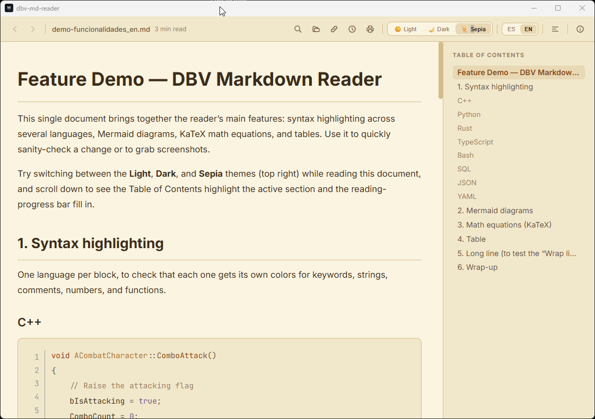

# DBV Markdown Reader

**[🇪🇸 Español](./README.md) · 🇬🇧 English**

[](https://github.com/davidbuenov/dbv-md-reader/releases)
[](https://apps.microsoft.com/detail/9n7bmdzgcp0s)
[](https://dbv-markdown-reader.uptodown.com/mac)


[](https://github.com/davidbuenov/dbv-md-reader/commits/master)
[](https://github.com/davidbuenov/dbv-specs-ops)

> Native Markdown (`.md`) reader and editor — ultra-lightweight, secure and fast for Windows, Linux, macOS and Android, built with Rust and Tauri v2.

**[🌐 View the project website](https://davidbuenov.github.io/dbv-md-reader/en/)**



---

## 📑 Table of Contents

- [Download & Install](#-download--install)
  - [Windows](#-windows)
  - [Linux](#-linux)
  - [macOS](#-macos)
  - [Android](#-android)
- [About the project](#-about-the-project)
- [Key Features](#-key-features)
- [Keyboard Shortcuts](#-keyboard-shortcuts)
- [For developers](#-for-developers)
- [Project Structure](#-project-structure)
- [Changelog](#-changelog)
- [Contributing](#-contributing)
- [Fun fact: a natural fit for Microsoft PowerToys](#-fun-fact-a-natural-fit-for-microsoft-powertoys)
- [License](#-license)
- [Author & Credits](#-author--credits)

---

## 🚀 Download & Install

**You don't need to install Rust, Node.js, or any development tooling.** The **DBV Markdown Reader** installer bundles everything it needs — including Windows' own rendering engine (WebView2) — and associates `.md` files with itself automatically.

### 🪟 Windows

#### 🏬 Microsoft Store (recommended on Windows 11)

**[🛒 Get it on Microsoft Store](https://apps.microsoft.com/detail/9n7bmdzgcp0s)**

The preferred route on Windows 11: the package is signed by the Store itself (no SmartScreen warning like the `.exe` gets), installs in one click, and updates itself. If you'd rather not use the Store, or you're on Windows 10, use the `.exe` installer below.

#### 1️⃣ Download (`.exe` installer)

**[⬇️ See all versions (Releases)](https://github.com/davidbuenov/dbv-md-reader/releases)**

Download the installer for the latest version: `dbv-markdown-reader_x.y.z_x64-setup.exe`.

Your browser may warn that the file "isn't commonly downloaded" or "isn't trusted" (Microsoft Edge/Chrome SmartScreen). This is normal for new installers without a commercial code-signing certificate: in Edge, open the downloads panel and click **Show more → Keep** (or **Keep anyway**).

#### 2️⃣ Install

Double-click the downloaded installer. It doesn't require administrator permissions (it installs for your user only) nor an internet connection during setup — the required WebView2 runtime already ships inside. Windows may also show an "Unrecognized publisher" warning when you run it — click **More info → Run anyway**.

Before copying files, the installer shows a screen with two independent checkboxes (both checked by default, but you can uncheck either):

1. **Context menu**: whether **DBV Markdown Reader** appears as an option when you right-click a `.md` file → **Open with...**.
2. **Default application**: whether it also becomes the app that opens `.md` files on double-click.

You can change this at any time from Windows' **Settings → Apps → Default apps**.

> If you had a previous version installed with a different (or no) `.md` association screen, and the "Open with" menu still shows a duplicate entry or the old icon, uninstall the previous version first from "Installed apps" in Windows, then install the new one — earlier versions used a different internal identifier that the uninstaller doesn't automatically clean up between versions.

#### 3️⃣ Update

From here on you don't need to come back to this page for every new version. Open the **About** panel (ⓘ icon in the top bar) and click **Check for updates**. The check is always on-demand — it never runs on its own at startup, so it doesn't affect the app's instant launch.

- If you already have the latest version: **"You already have the latest version."**
- If a new one is available: **"New version X.Y.Z available."** and the button becomes **Update** — one click downloads, installs and restarts the app for you, without leaving **DBV Markdown Reader**, your browser, or the Releases page.

### 🐧 Linux

**[⬇️ Download the `.deb` or the `.AppImage` from Releases](https://github.com/davidbuenov/dbv-md-reader/releases)** — built automatically for every version.

- **`.deb` (Debian, Ubuntu, Linux Mint and derivatives):** `sudo dpkg -i dbv-md-reader_x.y.z_amd64.deb` (or double-click it from your file manager). This is the recommended option — it installs the app system-wide and registers the `.md` association.
- **`.AppImage` (any distribution):** make it executable (`chmod +x dbv-md-reader_x.y.z_amd64.AppImage`) and run it directly. It's portable (no installation required), but it does **not** automatically associate with `.md` files — for that you need an additional tool like [AppImageLauncher](https://github.com/TheAssassin/AppImageLauncher).

> **Note:** the Linux channel doesn't have built-in update checking yet (the "Check for updates" button in the "About" panel) — download the new version from Releases whenever you want to update.

### 🍎 macOS

#### 🟢 Uptodown (recommended on macOS)

**[⬇️ Get it on Uptodown](https://dbv-markdown-reader.uptodown.com/mac)**

Via Uptodown you download the `.dmg` directly from their website, without going through GitHub's Releases page. It's still unsigned and non-notarized by Apple (see the warning below), but it's the simplest way to find the latest version without having to browse GitHub.

**[⬇️ Download the `.dmg` from Releases](https://github.com/davidbuenov/dbv-md-reader/releases)** — generated automatically for every version via CI (see below).

It's unsigned and non-notarized: Apple's signing and notarization require a paid account (Apple Developer Program, $99/year) that this project doesn't use, so macOS will block it the first time ("can't be opened because the developer cannot be verified"). To open it:

- Right-click (or `Ctrl` + click) on `DBV Markdown Reader.app` → **Open** → confirm in the dialog. Only needed the first time.
- Or, from the Terminal: `xattr -cr "DBV Markdown Reader.app"` before opening it.

If you'd rather build your own executable instead of downloading the `.dmg`, you can do it in a couple of minutes:

```bash
git clone https://github.com/davidbuenov/dbv-md-reader.git
cd dbv-md-reader
npm install
npm run tauri build
```

The resulting `.app` lands in `src-tauri/target/release/bundle/macos/`, also unsigned — same Gatekeeper warning and same fix as above (`xattr -cr "src-tauri/target/release/bundle/macos/DBV Markdown Reader.app"`).

Requires Xcode Command Line Tools (`xcode-select --install`), [Rust](https://rustup.rs/) and Node.js 18+ installed — see the [For developers](#-for-developers) section below for the setup shared across all three platforms.

### 🤖 Android

**[🛒 Get it on Google Play Store](https://play.google.com/store/apps/details?id=com.davidbuenov.dbv_md_reader)** *(currently in store publication process)*

- **Ultra-lightweight native touch reader:** designed for phones and tablets with a streamlined touch interface and strict compliance with system insets (status bar, notch, and navigation bar).
- **Storage Access Framework (SAF):** open individual Markdown files in 1 tap, or browse entire folder trees with support for relative local images and cross-document links.
- **WhatsApp, Telegram, and Gmail integration:** open and view Markdown files shared directly from messaging and mail apps via in-memory streaming without downloading first.
- **Mobile theme and language switcher:** floating Settings menu (⚙️) with instant switching between Light, Dark, and Sepia themes, and Spanish/English language.
- **Universal signed AAB bundle:** official release package prepared for Google Play App Signing compiled for ARM64, ARMv7, x86, and x86_64 architectures.

---

## 📌 About the project

**DBV Markdown Reader** is a native app for **reading and editing Markdown (`.md`) files** — with official Releases for Windows and Linux, and a local build for macOS. It offers instant launch (< 200 ms), a lightweight executable (< 20 MB), and RAM usage under 64 MB, in both reading and Edit Mode (see [the real cost breakdown](#-performance--measured-not-just-claimed) below).

It replaces the weight of Electron-based viewers or heavy IDEs with a lightweight native executable that sanitizes rendered HTML against XSS attacks via **DOMPurify**.

### 📊 Performance — measured, not just claimed

Reproducible benchmark (7 runs per measurement, best and worst discarded, the rest averaged — methodology and reference-machine data in [`dbv-specs-ops/BENCHMARK_RESULTS.md`](./dbv-specs-ops/BENCHMARK_RESULTS.md), reproducible by anyone with `pwsh scripts/benchmark.ps1`):

| Measurement | Result |
| --- | --- |
| Startup (cold / warm) | ~20 ms |
| Own process RAM (private memory) | ~7-8 MB |
| Total RAM, including the WebView2 engine (private memory) | ~215-250 MB |
| CPU at idle | 0% |

*"Private memory" excludes code pages that Windows physically shares between any app using WebView2 (Microsoft Edge's rendering engine, preinstalled on Windows 11) — unlike Electron, which shares nothing between apps. This is the figure that reflects this app's real, exclusive cost — neither inflated nor trimmed for convenience.*

#### How much does Edit Mode cost? — same benchmark, before and after

A fair question for any built-in editor is whether it bloats the app. The same reproducible benchmark was run against the `.exe` from the version right before Edit Mode was added (`v0.10.0`, read-only) and against this version (`v0.11.0`, with a split pane, line numbers, resizable panels, scroll sync, and conflict handling):

| Measurement | v0.10.0 (read-only) | v0.11.0 (+ Edit Mode) | Difference |
| --- | --- | --- | --- |
| Executable size | 16.35 MB | 16.36 MB | +0.01 MB (+0.06%) |
| Cold startup | 36 ms | 32 ms | −4 ms |
| Warm startup | 31 ms | 26 ms | −5 ms |
| Own process private RAM (small doc) | 7.5 MB | 7.2 MB | −0.3 MB |
| Own process private RAM (large doc) | 7.7 MB | 7.9 MB | +0.2 MB |
| CPU at idle | 0% | 0% | no change |

The differences fall within normal run-to-run measurement noise (none exceed a few tenths of a MB or a few ms) — there is no measurable cost. That's by design, not luck: the editor reuses the same plain `<textarea>` and the same rendering engine (`markdown-it` + DOMPurify + Prism/Mermaid/KaTeX) the reading mode already used, instead of pulling in a code-editor library like CodeMirror or Monaco — the same approach [READU.md](https://github.com/breezy89757/READU.md) already takes, the app that inspired it (see credits below).

Original comparison (a one-off measurement with Task Manager, prior to the reproducible benchmark above) with the same 2 `.md` files open at once:


| Application | RAM (same 2 files open) |
| --- | --- |
| Visual Studio Code | 885.8 MB |
| Notepad++ | 21.5 MB |
| **dbv-md-reader** | **5.9 MB** |

Not even Notepad++ (the historical benchmark for lightness on Windows) comes close.

**Built with:**
- **Core / Backend:** Rust + Tauri v2 (the system's native rendering engine: WebView2 on Windows, WebKitGTK on Linux, WKWebView on macOS).
- **Security:** DOMPurify (JS) sanitizes the rendered HTML against XSS attacks.
- **Auto-Reload & Remote files:** `notify` (file watcher) and `ureq` (HTTP client for remote `.md` files) in Rust.
- **Frontend:** HTML5, CSS3 (Tailwind CSS), JavaScript (Vanilla).
- **Rendering:** `markdown-it` (CommonMark), `Prism.js` (syntax highlighting), `mermaid.js` (SVG vector diagrams) and `KaTeX` (LaTeX math equations).

---

## ✨ Key Features

- **Edit Mode:** split pane with raw Markdown on the left (with line numbers) and the rendered view on the right, scroll-synced by line in either direction — no code-editor library, so it costs nothing in size or RAM. Draggable resize handles. Conflict handling if the file changes externally while you're editing (same model as Windows Notepad: silent if you have no unsaved changes, a one-time prompt if you do). Includes a built-in Markdown syntax cheat sheet ("?" button), a 16-icon formatting toolbar (bold, italic, headings, lists, links, images, tables...) that wraps the selection or inserts a ready-to-fill skeleton, and `Tab`/`Shift+Tab` to indent/outdent lists without leaving the editor.
- **CLI / double-click opening:** Open any `.md` file directly from the command line or by associating it via *"Open with..."* (e.g. `dbv-md-reader.exe C:\notes\readme.md`).
- **Single instance:** opening several `.md` files from Windows Explorer doesn't spawn multiple processes — every window lives under a single process (visible in Task Manager), each with its own document, zoom and search.
- **Recent Files:** panel with the last documents you explicitly opened, so you don't have to hunt for them again.
- **Directory tree explorer + Quick Open:** a "Files" tab next to the Index, rooted at the active document's folder, with expandable subfolders and a text filter. `Ctrl/Cmd + click` on any file (or its context menu) opens it in a new window instead of replacing the current one; right-click also offers "Reveal in File Explorer". Drag an entire folder onto the window to set it as the root. `Ctrl/Cmd + K` opens a quick switcher to jump to any file by name without touching the mouse.
- **Auto-Reload:** the view reloads itself (preserving scroll position) when the open file is edited and saved from another application.
- **Hybrid rendering:** supports standard Markdown, GitHub Flavored Markdown (tables, ~~strikethrough~~, task lists `- [ ]`, footnotes `[^1]`), safely embedded HTML, local images and Mermaid diagrams. Right-click a Mermaid diagram → "Open in mermaid.live" to inspect it with free zoom.
- **Always on Top:** button in the top bar to pin the window above others while you work — designed to keep documentation visible alongside an editor or IDE.
- **Real-color syntax highlighting:** ~24 languages supported (C/C++, Python, Rust, Bash, JSON, YAML, TypeScript, Go, Java, C#, SQL, TOML, PowerShell...), with line numbers and a toggle for line wrapping in blocks with very long lines. Colors adapt to each theme (Light, Dark, Sepia) instead of always using a fixed dark palette.
- **Math equations:** inline LaTeX syntax (`$...$`), block (`$$...$$` or ` ```math `) rendered with KaTeX — fractions, roots, sums, sub/superscripts and symbols.
- **Remote documents:** open and navigate links to `.md` files hosted at a URL (`http(s)://`), in addition to local ones.
- **Strict security:** sanitization of dangerous tags and attributes (DOMPurify) before insertion into WebView2.
- **Navigation & Table of Contents:** floating/sidebar Table of Contents (TOC) auto-generated from headings, with the visible section highlighted as you scroll. Estimated reading time is shown next to the document name, and a thin progress bar under the header tracks scroll progress.
- **In-page search:** `Ctrl + F` shortcut for fast, intuitive text search.
- **Visual themes:** Light mode (GitHub Light), Dark mode (VS Code / GitHub Dark), and Sepia (for extended reading).
- **Print / Export to PDF:** `Ctrl + P` opens the native print dialog with real pagination (A4, no titles/tables/code blocks split across pages). *Tip (Windows):* if you don't want the PDF to include the URL/timestamp footer that the print dialog itself adds (WebView2's Chromium engine), expand "More settings" and uncheck "Headers and footers" — the browser remembers this preference for next time. On macOS/Linux the native dialog is different (macOS print panel / GTK on Linux) and it hasn't been confirmed whether it adds the same footer.
- **Check for updates:** button in the "About" panel — never checked automatically at startup (instant launch stays intact). If a new version is available, it can be installed in one click without leaving the app.

> 🧪 **Want to see all of this in action without hunting for your own files?** Open any of the files in [`testfiles/`](testfiles/) (`demo-funcionalidades_es.md` / `demo-funcionalidades_en.md`) — a single document with syntax highlighting in 8 languages, a Mermaid diagram, KaTeX equations and a table, designed to try or showcase the reader's features at a glance.

---

## 📁 Included Templates

The repository includes a [`templates/`](templates/) folder with **20 ready-to-use Markdown templates**, in Spanish and English, grouped by category (Academic, Software development, Project management, Meetings & teams, Personal — everything from meeting minutes and thesis supervision logs to a CV or a travel itinerary). Copy them under a new name and open them with **DBV Markdown Reader** in Edit Mode.

**[📋 See the full template index](templates/README.md)**

---

## ⌨️ Keyboard Shortcuts

| Shortcut | Action |
| --- | --- |
| `Ctrl/Cmd + O` | Open file |
| `Ctrl/Cmd + F` | Search within the document |
| `Ctrl/Cmd + K` | Quick Open — jump to a file by name |
| `Ctrl/Cmd + E` | Toggle Edit Mode |
| `Ctrl/Cmd + S` | Save (in Edit Mode) |
| `Ctrl/Cmd + B` / `Ctrl/Cmd + I` | Bold / italic (with the cursor in the editor) |
| `Tab` / `Shift + Tab` | Indent / outdent the line or selection (in the editor) |
| `Ctrl/Cmd + P` | Print / export to PDF |
| `Ctrl/Cmd + +` / `-` / `0` | Zoom in / out / reset |
| `Alt + ←` / `Alt + →` | Back / forward in navigation history |
| `Home` / `End` | Jump to the beginning / end of the document (outside a text field) |
| `Esc` | Close the open panel or modal |

**Mouse:** double-clicking a word in the editor selects it (ready for `Ctrl/Cmd + B` / `I`); right-clicking a Mermaid diagram opens "mermaid.live"; right-clicking a file/folder in the tree offers "Open in new window" / "Reveal in File Explorer".

> The full list, including keyboard navigation for Quick Open and search, also lives in the app's built-in help (the "?" button in Edit Mode).

---

## 🧑‍💻 For developers

Everything above is all a regular user needs. The following only applies if you want to **modify the source code or build it yourself** — it's not required to use the application.

### Requirements

- **Rust:** `rustc 1.76+` and `cargo` ([rustup.rs](https://rustup.rs/))
- **Node.js:** `v18+` and `npm`
- **Windows Build Tools:** Visual Studio's C++ Build Tools (MSVC).

### Running in development mode

Use the scripts included in the project root:

**Windows:**
```cmd
start.cmd
```

**macOS / Linux:**
```bash
./start.sh
```

Or running manually:
```bash
npm run dev
# or
cargo tauri dev
```

To stop it: `stop.cmd` (Windows) or `./stop.sh` (macOS/Linux).

### Tests

```bash
npm test          # Unit tests (fast, no network)
npm run test:all  # Includes the integration test that downloads a real .md file (RF-08A)
```

### Publishing a new Release (with update support, RF-13)

⚠️ **Mandatory checklist.** Since the "Check for updates" button exists, publishing a Release without step 3 (`latest.json`) leaves the app working, but that button will never find the new version — it's easy to forget because the build and `git push` keep working fine without it.

1. Bump the version in `package.json`, `src-tauri/Cargo.toml` and `src-tauri/tauri.conf.json`, and move the `[Unreleased]` section of `dbv-specs-ops/CHANGELOG.md` to `[x.y.z] - date`.
2. Build with the signing variables set in the environment, so each installer's `.sig` file is also generated:
   ```bash
   export TAURI_SIGNING_PRIVATE_KEY="<path to your minisign private key>"
   export TAURI_SIGNING_PRIVATE_KEY_PASSWORD="<that key's password>"
   npm run build
   ```
   `npm run build` compiles and also automatically renames the installer (Tauri generates it with the app's full name, including a space) to `dbv-markdown-reader_x.y.z_x64-setup.exe`, space-free and ready for its download URL.
3. **Generate `latest.json` automatically** (it's not built by hand, to avoid mistakes or forgetting it):
   ```bash
   npm run release:manifest -- --notes "Short summary of this version"
   ```
   Writes `latest.json` to the repo root (not committed, see `.gitignore`), reading the version from `tauri.conf.json` and the `.sig` generated in step 2.
4. `git commit`, `git tag vx.y.z`, `git push origin master --tags`.
5. Create the GitHub Release uploading **all three files**: the installer `dbv-markdown-reader_x.y.z_x64-setup.exe`, its `.sig`, and `latest.json`.

The signing private key **is not in this repository** — it's generated and kept by whoever maintains the project (`npx tauri signer generate`). Losing it forces publishing a new public key and manually updating existing installations once.

### Microsoft Store (MSIX channel, published)

In addition to the NSIS installer on GitHub Releases, the project publishes an MSIX package on Microsoft Store: **[apps.microsoft.com/detail/9n7bmdzgcp0s](https://apps.microsoft.com/detail/9n7bmdzgcp0s)** (Partner Center identity configured, no own signing certificate needed — the Store signs the package). Full submission and update checklist for this channel in [`dbv-specs-ops/docs/MICROSOFT_STORE.md`](./dbv-specs-ops/docs/MICROSOFT_STORE.md).

### Linux Release (automatic, via CI)

Unlike Windows, the `.deb` and `.AppImage` for Linux are **not built by hand**: `.github/workflows/release-linux.yml` builds them automatically.

- **New version (normal case):** running `git push --tags` for `vX.Y.Z` triggers the workflow on its own and uploads the artifacts as a **draft** GitHub Release. Fill in that same draft with the 3 Windows files (checklist above) instead of creating a Release from scratch, and click **Publish** once both platforms are ready.
- **Adding Linux to a version already published by hand (as happened with 0.7.0):** trigger it manually from GitHub's **Actions** tab (`Release Linux` → `Run workflow`) with the `draft` input set to **`false`** — this way it joins that version's already-published Release instead of looking for (and not finding) a draft. With `draft: true` on an already-published Release, the workflow fails on purpose instead of risking mishandling it.

### macOS Release (automatic, via CI)

Same as Linux, the `.dmg` and `.app` for macOS are **not built by hand**: `.github/workflows/release-macos.yml` builds them automatically on a `macos-latest` runner, without Apple signing or notarization (same reason as the local build — see the [🍎 macOS](#-macos) section).

- Same behavior as `release-linux.yml`: triggers on its own on `git push --tags`, uploads the artifacts as a draft (or joins an already-published Release via `workflow_dispatch` + `draft: false`).
- The unsigned `.dmg` generated here is also the artifact published on [Uptodown](https://dbv-markdown-reader.uptodown.com/mac) (unlike Microsoft Store or the Mac App Store, it doesn't require Apple signing) — updating each new version on Uptodown is manual, via their [editors panel](https://support.uptodown.com/hc/es/articles/360053260491).

---

## 📂 Project Structure

```
dbv-md-reader/
├── src-tauri/             # Rust source code and Tauri v2 configuration
│   ├── src/main.rs        # Rust entry point, CLI args and Tauri commands
│   ├── nsis/               # Branding assets and hooks for the Windows installer (NSIS)
│   ├── tauri.conf.json    # Base config + tauri.windows/linux/macos.conf.json (merged per platform)
│   └── Cargo.toml         # Rust dependencies (tauri, notify, ureq, etc.)
├── .github/workflows/     # CI: release-linux.yml + release-macos.yml (build on tag)
├── src/                   # Web UI (HTML/CSS/JS)
│   ├── index.html         # Main layout and TOC sidebar
│   ├── app.js             # Rendering logic (markdown-it, mermaid, Prism)
│   └── styles.css         # Styles and color tokens
├── dbv-specs-ops/         # SDD specifications and engineering framework
│   ├── project.config.md  # Project identity and file headers
│   ├── docs/               # SPECIFICATIONS, ARCHITECTURE, DESIGN
│   ├── task.md             # Backlog and status snapshot
│   ├── memory.md           # Architecture decisions (ADRs)
│   └── CHANGELOG.md        # Version history
├── CLAUDE.md              # Activation for Claude Code
├── GEMINI.md              # Activation for Gemini CLI
├── ANTIGRAVITY.md         # Reference for Antigravity (VS Code)
├── start.cmd / stop.cmd   # Run scripts for Windows
├── start.sh / stop.sh     # Run scripts for Linux/macOS
├── LICENSE                # MIT license
└── README.md              # Spanish README (this file's counterpart, README.en.md, is the English version)
```

---

## 📋 Changelog

See [dbv-specs-ops/CHANGELOG.md](./dbv-specs-ops/CHANGELOG.md) for the version history.

---

## 🤝 Contributing

Want to propose a change or fix a bug? Contributions go through fork + Pull Request against `master` (a protected branch). Full guide, environment setup and pre-PR checklist in [CONTRIBUTING.md](./CONTRIBUTING.md).

---

## 🔷 Fun fact: a natural fit for Microsoft PowerToys

> Anecdotal note, not a claim of affiliation: **DBV Markdown Reader is not part of Microsoft PowerToys and is not backed by Microsoft.**

[PowerToys issue #45267](https://github.com/microsoft/PowerToys/issues/45267) asks for a lightweight, read-only "Markdown Reader" with TOC, search and Mermaid support — as an alternative to opening a full IDE just to read documentation. Without aiming for it on purpose, dbv-md-reader already meets most of those requirements:

| PowerToys #45267 requirement | Status in dbv-md-reader |
| --- | --- |
| Persistent, read-only viewer | ✅ |
| Clickable Table of Contents | ✅ |
| Active section highlighted while scrolling | ✅ |
| Zoom | ✅ |
| `Ctrl+F` search | ✅ |
| GitHub Flavored Markdown (tables, strikethrough, task lists, footnotes, autolinks, HTML) | ✅ |
| Mermaid diagrams | ✅ |
| Multiple independent windows | ✅ |
| Windows Explorer integration (`.md` association, context menu) | ✅ |
| WebView2 | ✅ |
| Lightweight architecture (see [benchmark](#-performance--measured-not-just-claimed)) | ✅ |
| Always on Top | ✅ |
| Windows Snap Layouts | ✅ |
| PowerToys Run | ❌ not implemented |
| Mica (Windows 11 translucent backdrop) | ❌ evaluated and shelved for now |
| WinUI 3 / Markdig | Not used — own architecture (Rust + Tauri v2 + `markdown-it`), not a functional limitation |

The architectural differences (Tauri instead of WinUI 3, `markdown-it` instead of Markdig) aren't shortcomings — they're another valid way of solving the same problem, already implemented and working.

---

## 📄 License

Licensed under [MIT](./LICENSE).

Copyright (c) 2026 David Bueno Vallejo

---

## ✍️ Author & Credits

### 👤 David Bueno Vallejo

> Original idea, architecture, project direction and testing on real hardware.

[](https://www.linkedin.com/in/davidbueno/)
[](https://davidbuenov.com)
[](https://github.com/davidbuenov)

### 🙏 Acknowledgements

Thanks to everyone who has helped by testing the app, finding bugs and suggesting improvements:

- José M. Alarcón Aguín
- Victor Estival
- Julio Lorca
- Juan Ignacio Caballero — suggested the idea for the Directory Tree Explorer (RF-25/v0.13.0) in [Issue #5](https://github.com/davidbuenov/dbv-md-reader/issues/5).
- Jacinto Parga — fixed `.md` file association on Linux in [PR #9](https://github.com/davidbuenov/dbv-md-reader/pull/9).

### 🤖 Built with AI

| Tool | Role |
| --- | --- |
| **[Claude Code](https://claude.com/claude-code)** · *Anthropic* | Full pair programming: Rust/Tauri architecture, NSIS installer (`.md` association, single instance), signed update checking, security review and the `/ship` cycle end to end. |

> 🛠️ Built with the **[dbv-specs-ops](https://github.com/davidbuenov/dbv-specs-ops)** framework — Spec-Driven Development, free and open.
