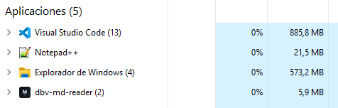

# DBV Markdown Reader

[](https://github.com/davidbuenov/dbv-md-reader/releases)


[](https://github.com/davidbuenov/dbv-md-reader/commits/master)
[](https://github.com/davidbuenov/dbv-specs-ops)

> Lector nativo de Markdown (`.md`) de solo lectura ultra-ligero, seguro y veloz para Windows basado en Rust y Tauri v2.

**[🌐 Ver la web del proyecto](https://davidbuenov.github.io/dbv-md-reader/)**

---

## 🚀 Descárgalo e instálalo

**No necesitas instalar Rust, Node.js, ni ninguna herramienta de programación.** El instalador de **DBV Markdown Reader** trae todo lo necesario —incluido el motor de renderizado de Windows (WebView2)— y asocia los archivos `.md` contigo automáticamente.

### 1️⃣ Descarga

**[⬇️ Ver todas las versiones (Releases)](https://github.com/davidbuenov/dbv-md-reader/releases)**

Descarga el instalador de la última versión: `dbv-markdown-reader_x.y.z_x64-setup.exe`.

El navegador puede avisar de que el archivo "no se descarga habitualmente" o "no es de confianza" (SmartScreen de Microsoft Edge/Chrome). Es normal en instaladores nuevos y sin firma comercial: en Edge, abre el panel de descargas y pulsa **Mostrar más → Mantener** (o **Conservar de todos modos**).

### 2️⃣ Instala

Haz doble clic sobre el instalador descargado. No requiere permisos de administrador (se instala solo para tu usuario) ni conexión a internet durante la instalación —el WebView2 necesario ya viaja incluido—. Windows puede mostrar también un aviso de "Editor no reconocido" al ejecutarlo — pulsa **Más información → Ejecutar de todas formas**.

Antes de copiar los archivos, el instalador muestra una pantalla con dos casillas independientes (ambas marcadas por defecto, pero desmarcables):

1. **Menú contextual**: que **DBV Markdown Reader** aparezca como opción al pulsar con el botón derecho sobre un `.md` → **Abrir con...**.
2. **Aplicación predeterminada**: que además sea la aplicación que abre los `.md` al hacer doble clic.

Puedes cambiar esta configuración cuando quieras desde **Configuración → Aplicaciones → Aplicaciones predeterminadas** de Windows.

> Si ya tenías instalada una versión anterior con la pantalla de asociación de `.md` distinta (o sin ella) y el menú "Abrir con" te sigue mostrando una entrada duplicada o con el icono antiguo, desinstala primero la versión anterior desde "Aplicaciones instaladas" de Windows y luego instala la nueva — versiones previas usaban un identificador interno distinto que el desinstalador no limpia automáticamente entre versiones.

### 3️⃣ Actualiza

A partir de aquí ya no necesitas volver a esta página para cada versión nueva. Abre el panel **Acerca de** (icono ⓘ de la barra superior) y pulsa **Buscar actualizaciones**. La comprobación es siempre bajo demanda — nunca se ejecuta sola al arrancar, para no afectar al arranque instantáneo.

- Si ya tienes la última versión: **"Ya tienes la última versión."**
- Si hay una nueva: **"Nueva versión X.Y.Z disponible."** y el botón cambia a **Actualizar** — un clic descarga, instala y reinicia la app por ti, sin salir de **DBV Markdown Reader** ni pasar por el navegador ni por Releases.

---

## 🐧 Linux

**[⬇️ Descarga el `.deb` o el `.AppImage` desde Releases](https://github.com/davidbuenov/dbv-md-reader/releases)** — se generan automáticamente en cada versión.

- **`.deb` (Debian, Ubuntu, Linux Mint y derivadas):** `sudo dpkg -i dbv-md-reader_x.y.z_amd64.deb` (o doble clic desde el gestor de archivos). Es la opción recomendada — instala la app en el sistema y registra la asociación con `.md`.
- **`.AppImage` (cualquier distribución):** dale permisos de ejecución (`chmod +x dbv-md-reader_x.y.z_amd64.AppImage`) y ejecútalo directamente. Es portátil (no requiere instalación), pero **no** se asocia automáticamente con archivos `.md` — para eso hace falta una herramienta adicional como [AppImageLauncher](https://github.com/TheAssassin/AppImageLauncher).

> **Nota:** el canal de Linux todavía no tiene comprobación de actualizaciones integrada (botón "Buscar actualizaciones" del panel "Acerca de") — descarga la versión nueva desde Releases cuando quieras actualizar.

---

## 🍎 macOS

No se publica un instalador de macOS: la firma y notarización de Apple requieren una cuenta de pago (Apple Developer Program, 99 $/año) que este proyecto no usa. En su lugar, puedes compilar tu propio ejecutable en un par de minutos:

```bash
git clone https://github.com/davidbuenov/dbv-md-reader.git
cd dbv-md-reader
npm install
npm run tauri build
```

El `.app` resultante queda en `src-tauri/target/release/bundle/macos/`. Al no estar firmado, **macOS lo bloqueará la primera vez** ("no se puede abrir porque su desarrollador no puede verificarse"). Para abrirlo:

- Clic derecho (o `Ctrl` + clic) sobre `DBV Markdown Reader.app` → **Abrir** → confirmar en el diálogo. Solo hace falta la primera vez.
- O, desde la Terminal: `xattr -cr "src-tauri/target/release/bundle/macos/DBV Markdown Reader.app"` antes de abrirlo.

Requiere tener instalados Xcode Command Line Tools (`xcode-select --install`), [Rust](https://rustup.rs/) y Node.js 18+ — ver la sección [Para desarrolladores](#-para-desarrolladores) más abajo para el detalle común a las tres plataformas.

---

## 📑 Índice

- [Descárgalo e instálalo](#-descárgalo-e-instálalo)
- [Linux](#-linux)
- [macOS](#-macos)
- [Sobre el proyecto](#sobre-el-proyecto)
- [Características Principales](#características-principales)
- [Para desarrolladores](#-para-desarrolladores)
- [Estructura del Proyecto](#estructura-del-proyecto)
- [Changelog](#changelog)
- [Licencia](#licencia)
- [Autor y Créditos](#autor-y-créditos)

---

## 📌 Sobre el proyecto

**DBV Markdown Reader** es una aplicación nativa diseñada exclusivamente para la **lectura de archivos Markdown (`.md`)** — con Release oficial para Windows y Linux, y compilación local para macOS. Ofrece una apertura instantánea (< 200 ms), un ejecutable ligero (< 20 MB) y un consumo de memoria RAM inferior a 64 MB.

Sustituye la pesadez de visores basados en Electron o IDEs pesados por un ejecutable nativo liviano con protección anti-XSS mediante **DOMPurify** sobre el HTML ya renderizado.

### 📊 Comparativa real de memoria

Los mismos 2 archivos `.md` abiertos a la vez en Visual Studio Code, Notepad++ y `dbv-md-reader` — memoria según el Administrador de Tareas de Windows:



| Aplicación | RAM (mismos 2 archivos abiertos) |
| --- | --- |
| Visual Studio Code | 885,8 MB |
| Notepad++ | 21,5 MB |
| **dbv-md-reader** | **5,9 MB** |

Ni siquiera Notepad++ (referencia histórica de ligereza en Windows) se le acerca.

**Construido con:**
- **Core / Backend:** Rust + Tauri v2 (motor de renderizado nativo del sistema: WebView2 en Windows, WebKitGTK en Linux, WKWebView en macOS).
- **Seguridad:** DOMPurify (JS) sanitiza el HTML renderizado contra ataques XSS.
- **Auto-Reload & Remotos:** `notify` (observador de archivos) y `ureq` (cliente HTTP para `.md` remotos) en Rust.
- **Frontend:** HTML5, CSS3 (Tailwind CSS), JavaScript (Vanilla).
- **Renderizado:** `markdown-it` (CommonMark), `Prism.js` (Syntax Highlighting), `mermaid.js` (Diagramas vectoriales SVG) y `KaTeX` (Ecuaciones matemáticas LaTeX).

---

## ✨ Características Principales

- **Apertura CLI / Doble Clic:** Abre directamente cualquier archivo `.md` desde la línea de comandos o asociándolo en *"Abrir con..."* (ej. `dbv-md-reader.exe C:\notas\readme.md`).
- **Instancia única:** abrir varios `.md` desde el Explorador de Windows no multiplica procesos — todas las ventanas viven bajo un único proceso (visible en el Administrador de Tareas), cada una con su propio documento, zoom y búsqueda.
- **Archivos Recientes:** Panel con los últimos documentos abiertos explícitamente, para no tener que volver a buscarlos.
- **Auto-Reload:** La vista se recarga sola (conservando el scroll) cuando el archivo abierto se edita y guarda desde otra aplicación.
- **Renderizado Híbrido:** Soporta Markdown estándar, HTML seguro incrustado, imágenes locales y diagramas Mermaid. Botón derecho sobre un diagrama Mermaid → "Abrir en mermaid.live" para inspeccionarlo con zoom libre.
- **Ecuaciones matemáticas:** Sintaxis LaTeX inline (`$...$`), en bloque (`$$...$$` o ` ```math `) renderizada con KaTeX — fracciones, raíces, sumatorios, subíndices/superíndices y símbolos.
- **Documentos remotos:** Abre y navega enlaces a `.md` alojados en una URL (`http(s)://`), además de los locales.
- **Seguridad Estricta:** Sanitización de etiquetas y atributos peligrosos (DOMPurify) antes de insertarse en el WebView2.
- **Navegación e Índice:** Tabla de Contenidos (TOC) flotante/lateral generada automáticamente a partir de los encabezados.
- **Búsqueda en Página:** Atajo `Ctrl + F` para buscar texto de forma rápida e intuitiva.
- **Temas Visuales:** Soporte para modo Claro (GitHub Light), Oscuro (VS Code / GitHub Dark) y Sepia (lectura prolongada).
- **Buscar actualizaciones:** Botón en el panel "Acerca de" — nunca se comprueba al arrancar (arranque instantáneo intacto). Si hay una versión nueva, se puede instalar en un clic sin salir de la app.

---

## 🧑‍💻 Para desarrolladores

Todo lo anterior es lo único que necesita un usuario normal. Lo siguiente solo aplica si quieres **modificar el código fuente o compilarlo tú mismo** — no hace falta para usar la aplicación.

### Requisitos

- **Rust:** `rustc 1.76+` y `cargo` ([rustup.rs](https://rustup.rs/))
- **Node.js:** `v18+` y `npm`
- **Build Tools para Windows:** C++ Build Tools (MSVC) de Visual Studio.

### Ejecutar en modo desarrollo

Usa los scripts incluidos en la raíz del proyecto:

**Windows:**
```cmd
start.cmd
```

**macOS / Linux:**
```bash
./start.sh
```

O ejecutando manualmente:
```bash
npm run dev
# o
cargo tauri dev
```

Para detenerlo: `stop.cmd` (Windows) o `./stop.sh` (macOS/Linux).

### Tests

```bash
npm test          # Tests unitarios (rápidos, sin red)
npm run test:all  # Incluye el test de integración que descarga un .md real (RF-08A)
```

### Publicar una nueva Release (con soporte de actualización, RF-13)

⚠️ **Checklist obligatorio.** Desde que existe el botón "Buscar actualizaciones", publicar una Release sin el paso 3 (`latest.json`) dejará la app funcionando pero ese botón nunca encontrará la versión nueva — es fácil de olvidar porque el build y el `git push` siguen funcionando igual sin él.

1. Sube de versión en `package.json`, `src-tauri/Cargo.toml` y `src-tauri/tauri.conf.json`, y mueve la sección `[Sin publicar]` de `dbv-specs-ops/CHANGELOG.md` a `[x.y.z] - fecha`.
2. Compila con las variables de firma en el entorno, para que también se genere el `.sig` de cada instalador:
   ```bash
   export TAURI_SIGNING_PRIVATE_KEY="<ruta a tu clave privada minisign>"
   export TAURI_SIGNING_PRIVATE_KEY_PASSWORD="<password de esa clave>"
   npm run build
   ```
   `npm run build` compila y además renombra automáticamente el instalador (Tauri lo genera con el nombre completo de la app, con espacio) a `dbv-markdown-reader_x.y.z_x64-setup.exe`, sin espacios, listo para su URL de descarga.
3. **Genera `latest.json` automáticamente** (no se construye a mano, para no equivocarse ni olvidarlo):
   ```bash
   npm run release:manifest -- --notes "Resumen breve de esta versión"
   ```
   Escribe `latest.json` en la raíz del repo (no se commitea, ver `.gitignore`) leyendo la versión de `tauri.conf.json` y el `.sig` que generó el paso 2.
4. `git commit`, `git tag vx.y.z`, `git push origin master --tags`.
5. Crea la Release de GitHub subiendo **los tres archivos**: el instalador `dbv-markdown-reader_x.y.z_x64-setup.exe`, su `.sig`, y `latest.json`.

La clave privada de firma **no está en este repositorio** — la genera y custodia quien mantiene el proyecto (`npx tauri signer generate`). Perderla obliga a publicar una clave pública nueva y a que las instalaciones existentes se actualicen a mano una vez.

### Microsoft Store (canal MSIX, en preparación)

Además del instalador NSIS de GitHub Releases, el proyecto tiene listo el empaquetado MSIX para Microsoft Store (identidad de Partner Center ya configurada, sin necesidad de certificado de firma propio — la Store firma el paquete). Checklist completo de envío y actualización de este canal en [`dbv-specs-ops/docs/MICROSOFT_STORE.md`](./dbv-specs-ops/docs/MICROSOFT_STORE.md).

### Release de Linux (automática, vía CI)

A diferencia de Windows, el `.deb` y el `.AppImage` de Linux **no se compilan a mano**: `.github/workflows/release-linux.yml` los construye automáticamente en cada `git push --tags` de una versión `vX.Y.Z` y los sube como borrador de GitHub Release. El único paso manual sigue siendo el de Windows (subir los 3 ficheros del checklist de arriba) — hazlo sobre ese mismo borrador que ya habrá creado la Action, en vez de crear la Release desde cero, y pulsa **Publish** cuando ambas plataformas estén listas.

---

## 📂 Estructura del Proyecto

```
dbv-md-reader/
├── src-tauri/             # Código fuente Rust y configuración Tauri v2
│   ├── src/main.rs        # Punto de entrada Rust, CLI args y mando Tauri
│   ├── nsis/              # Imágenes de marca y hooks del instalador Windows (NSIS)
│   ├── tauri.conf.json    # Config base + tauri.windows/linux/macos.conf.json (fusión por plataforma)
│   └── Cargo.toml         # Dependencias Rust (tauri, notify, ureq, etc.)
├── .github/workflows/     # CI: release-linux.yml (build .deb/.AppImage en cada tag)
├── src/                   # Interfaz de usuario Web (HTML/CSS/JS)
│   ├── index.html         # Maquetación principal y sidebar TOC
│   ├── app.js             # Lógica de renderizado (markdown-it, mermaid, Prism)
│   └── styles.css         # Estilos y tokens de color
├── dbv-specs-ops/         # Especificaciones SDD y marco de ingeniería
│   ├── project.config.md  # Identidad del proyecto y cabeceras
│   ├── docs/              # SPECIFICATIONS, ARCHITECTURE, DESIGN
│   ├── task.md            # Backlog y snapshot de estado
│   ├── memory.md          # Decisiones de arquitectura (ADRs)
│   └── CHANGELOG.md       # Historial de versiones
├── CLAUDE.md              # Activación para Claude Code
├── GEMINI.md              # Activación para Gemini CLI
├── ANTIGRAVITY.md         # Referencia para Antigravity (VS Code)
├── start.cmd / stop.cmd   # Scripts de ejecución en Windows
├── start.sh / stop.sh     # Scripts de ejecución en Linux/macOS
├── LICENSE                # Licencia MIT
└── README.md              # Este archivo
```

---

## 📋 Changelog

Consulta [dbv-specs-ops/CHANGELOG.md](./dbv-specs-ops/CHANGELOG.md) para ver el historial de cambios.

---

## 📄 Licencia

Licencia [MIT](./LICENSE).

Copyright (c) 2026 David Bueno Vallejo

---

## ✍️ Autor y Créditos

### 👤 David Bueno Vallejo

> Idea original, arquitectura, dirección del proyecto y pruebas en equipos reales.

[](https://www.linkedin.com/in/davidbueno/)
[](https://davidbuenov.com)
[](https://github.com/davidbuenov)

### 🤖 Construido con IA

| Herramienta | Rol |
| --- | --- |
| **[Claude Code](https://claude.com/claude-code)** · *Anthropic* | Pair programming completo: arquitectura Rust/Tauri, instalador NSIS (asociación `.md`, instancia única), comprobación de actualizaciones firmadas, revisión de seguridad y ciclo `/ship` de principio a fin. |

> 🛠️ Desarrollado con el framework **[dbv-specs-ops](https://github.com/davidbuenov/dbv-specs-ops)** — Spec-Driven Development, libre y gratuito.
