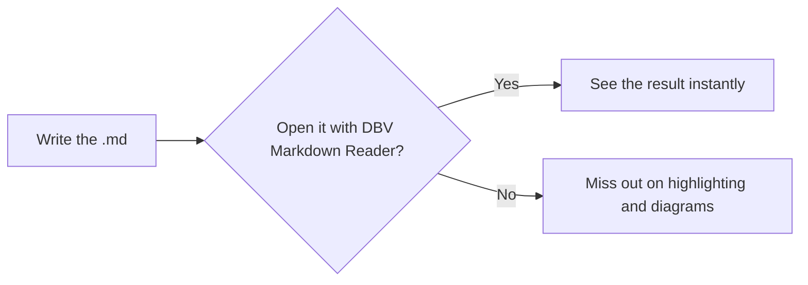
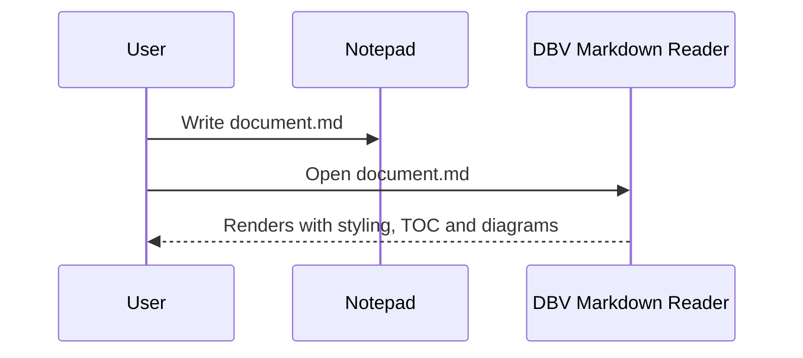

# 📘 Markdown & GitHub Flavored Markdown Reference Guide

> A complete cheatsheet for writing `.md` documents from any plain-text editor (Notepad, Notepad++, VS Code, etc.) and viewing them perfectly in **DBV Markdown Reader**.
>
> Copy, paste, tweak and save as `.md`. Everything you see below is also the rendered result — open this very file with DBV Markdown Reader to check it live.

---

## 📑 Table of contents

- [1. Headings](#1-headings)
- [2. Emphasis (bold, italic, strikethrough)](#2-emphasis-bold-italic-strikethrough)
- [3. Paragraphs and line breaks](#3-paragraphs-and-line-breaks)
- [4. Lists](#4-lists)
- [5. Task lists (GFM)](#5-task-lists-gfm)
- [6. Links](#6-links)
- [7. Images](#7-images)
- [8. Blockquotes](#8-blockquotes)
- [9. Inline code and code blocks](#9-inline-code-and-code-blocks)
- [10. Syntax highlighting by language](#10-syntax-highlighting-by-language)
- [11. Tables (GFM)](#11-tables-gfm)
- [12. Horizontal rules](#12-horizontal-rules)
- [13. Autolinks and GFM autolinking](#13-autolinks-and-gfm-autolinking)
- [14. Footnotes](#14-footnotes)
- [15. Embedded HTML](#15-embedded-html)
- [16. Escape characters](#16-escape-characters)
- [17. Emoji](#17-emoji)
- [18. Math formulas (KaTeX)](#18-math-formulas-katex)
- [19. Mermaid diagrams](#19-mermaid-diagrams)
- [20. GitHub-style alerts / callouts](#20-github-style-alerts--callouts)
- [21. Mentions and issue references (text only)](#21-mentions-and-issue-references-text-only)
- [22. Best practices and tips](#22-best-practices-and-tips)
- [23. Application keyboard shortcuts](#23-application-keyboard-shortcuts)

---

## 1. Headings

Six levels, from `#` (most important) to `######` (least important). Always leave a space after the `#`.

```markdown
# Heading level 1
## Heading level 2
### Heading level 3
#### Heading level 4
##### Heading level 5
###### Heading level 6
```

# Heading level 1
## Heading level 2
### Heading level 3
#### Heading level 4
##### Heading level 5
###### Heading level 6

> 💡 DBV Markdown Reader automatically generates a navigable **Table of Contents (TOC)** from these headings — you don't need to build it by hand.

"Setext" alternative (H1 and H2 only):

```markdown
Heading as H1
=============

Heading as H2
-------------
```

---

## 2. Emphasis (bold, italic, strikethrough)

```markdown
*italic* or _italic_
**bold** or __bold__
***bold and italic*** or **_combined_**
~~strikethrough~~ (GFM extension)
```

*italic* — **bold** — ***bold and italic*** — ~~strikethrough~~

---

## 3. Paragraphs and line breaks

A paragraph is one or more consecutive lines of text, separated from other paragraphs by **one blank line**.

To force a line break inside the same paragraph (`<br>`), end the line with **two or more spaces** or use `\` at the end:

```markdown
First line with two trailing spaces··
Second line, same paragraph.

First line with a trailing backslash\
Second line, same paragraph.
```

---

## 4. Lists

### Unordered lists

You can use `-`, `*` or `+` interchangeably (don't mix them at the same level):

```markdown
- First item
- Second item
  - Sub-item (indent with 2 spaces)
    - Sub-sub-item
- Third item
```

- First item
- Second item
  - Sub-item
    - Sub-sub-item
- Third item

### Ordered lists

```markdown
1. First step
2. Second step
   1. Sub-step
   2. Another sub-step
3. Third step
```

1. First step
2. Second step
   1. Sub-step
   2. Another sub-step
3. Third step

> 💡 The starting number is respected; the rest are renumbered automatically even if you write `1.` on every line.

---

## 5. Task lists (GFM)

Interactive checkboxes (GFM extension, supported via `markdown-it-task-lists`):

```markdown
- [x] Completed task
- [ ] Pending task
- [ ] Another pending task
  - [x] Completed sub-task
```

- [x] Completed task
- [ ] Pending task
- [ ] Another pending task
  - [x] Completed sub-task

---

## 6. Links

```markdown
[Link text](https://example.com)
[Link with title](https://example.com "This text appears on hover")
[Reference-style link][ref]
[Relative link to another file](./another-document.md)
[Link to a heading in this document](#6-links)

[ref]: https://example.com "Reference definition"
```

[Link text](https://example.com) · [Link with title](https://example.com "This text appears on hover") · [Reference-style link][ref] · [Relative link to another file](./README.en.md) · [Link to a heading](#6-links)

[ref]: https://example.com "Reference definition"

---

## 7. Images

Same as a link, with a `!` in front:

```markdown


[](https://github.com/davidbuenov/dbv-md-reader)
```


[](https://github.com/davidbuenov/dbv-md-reader)

> 💡 Relative paths are resolved relative to the location of the `.md` file itself opened in the reader.

---

## 8. Blockquotes

```markdown
> This is a simple quote.

> Multi-paragraph quote.
>
> Second paragraph of the same quote.

> Level 1
>> Level 2 (nested quote)
>>> Level 3
```

> This is a simple quote.

> Multi-paragraph quote.
>
> Second paragraph of the same quote.

> Level 1
>> Level 2 (nested quote)
>>> Level 3

---

## 9. Inline code and code blocks

Inline code with single backticks: `` `inline code` `` → `inline code`

Code blocks with **triple backticks** and a language name for syntax highlighting:

````markdown
```python
def greet(name: str) -> str:
    return f"Hello, {name}!"
```
````

```python
def greet(name: str) -> str:
    return f"Hello, {name}!"
```

You can also indent with 4 spaces for a "classic" code block (no language highlighting):

```markdown
    this is a code block
    indented with 4 spaces
```

Rendered:

    this is a code block
    indented with 4 spaces

---

## 10. Syntax highlighting by language

DBV Markdown Reader automatically colorizes code blocks according to the language identifier. Currently supported languages:

`bash` · `c` · `cpp` · `csharp` · `diff` · `docker` · `go` · `ini` · `java` · `json` · `jsx` · `markdown` · `powershell` · `python` · `rust` · `sql` · `toml`

```bash
#!/bin/bash
echo "Hello from Bash"
```

```json
{
  "name": "dbv-md-reader",
  "version": "1.0.0"
}
```

```rust
fn main() {
    println!("Hello from Rust");
}
```

> 💡 Every code block also includes **line numbering** and a button to copy its contents.

---

## 11. Tables (GFM)

Columns don't need to be visually aligned in the plain text, although it helps readability. Alignment is controlled with `:` in the separator row:

```markdown
| Left column        | Centered column   | Right column        |
| :------------------ | :-----------------: | --------------------: |
| Text                | Text                | Text                |
| Longer text sample  | Short               | 123                 |
```

| Left column        | Centered column   | Right column        |
| :------------------ | :-----------------: | --------------------: |
| Text                | Text                | Text                |
| Longer text sample  | Short               | 123                 |

---

## 12. Horizontal rules

Three or more hyphens, asterisks or underscores on their own line:

```markdown
---
***
___
```

---

## 13. Autolinks and GFM autolinking

```markdown
<https://example.com>
<mail@example.com>

https://example.com (a "bare" URL, GFM detects it automatically without needing < >)
```

<https://example.com> — <mail@example.com>

---

## 14. Footnotes

GFM extension supported via `markdown-it-footnote`:

```markdown
Here's a statement that needs backup[^1].

And another named note[^long-note].

[^1]: This is footnote number one.
[^long-note]: Footnotes can have full **Markdown formatting**,
    including multiple lines if properly indented.
```

Here's a statement that needs backup[^1].

And another named note[^long-note].

[^1]: This is footnote number one.
[^long-note]: Footnotes can have full **Markdown formatting**, including multiple lines if properly indented.

---

## 15. Embedded HTML

Markdown allows "raw" HTML for cases the syntax doesn't cover. DBV Markdown Reader sanitizes it with **DOMPurify** before displaying it (for security, `<script>` tags and dangerous attributes are stripped):

```markdown
<div align="center">
  <b>Centered bold text</b>
</div>

<details>
<summary>Click to expand</summary>

Hidden content that expands when clicked.

</details>
```

<details>
<summary>Click to expand</summary>

Hidden content that expands when clicked. Very useful for FAQs or hiding long log/code blocks.

</details>

---

## 16. Escape characters

Prefix with `\` to literally display a character that has special meaning in Markdown:

```markdown
\* This is not a list \*
\# This is not a heading
\[This is not a link\]
```

\* This is not a list \* — \# This is not a heading — \[This is not a link\]

Escapable characters: `` \ ` * _ { } [ ] ( ) # + - . ! | ``

---

## 17. Emoji

You can paste Unicode emoji directly (✅ 🚀 📌 ⚠️), or use `:name:` shorthand if your source editor (e.g. GitHub) supports it on export — DBV Markdown Reader displays the already-baked Unicode emoji in the text itself.

```markdown
✅ Done — 🚧 In progress — ❌ Blocked — ⚠️ Attention — 💡 Idea
```

✅ Done — 🚧 In progress — ❌ Blocked — ⚠️ Attention — 💡 Idea

---

## 18. Math formulas (KaTeX)

Math notation via **KaTeX**: `$...$` for inline formulas and `$$...$$` for centered block formulas.

```markdown
The rest-energy formula is $E = mc^2$, formulated by Einstein.

$$
\int_{a}^{b} f(x)\,dx = F(b) - F(a)
$$

$$
\frac{-b \pm \sqrt{b^2 - 4ac}}{2a}
$$
```

The rest-energy formula is $E = mc^2$, formulated by Einstein.

$$
\int_{a}^{b} f(x)\,dx = F(b) - F(a)
$$

$$
\frac{-b \pm \sqrt{b^2 - 4ac}}{2a}
$$

---

## 19. Mermaid diagrams

` ```mermaid ` blocks are rendered as interactive vector diagrams:

````markdown

````


It also supports sequence, class, state, Gantt, pie, gitGraph diagrams, etc. — any standard Mermaid syntax:



---

## 20. GitHub-style alerts / callouts

GitHub Flavored Markdown defines special blockquote blocks to draw attention to a message. They are written as a normal quote (`>`) with a label on the first line:

```markdown
> [!NOTE]
> Useful information the reader should know, even when skimming.

> [!TIP]
> Optional advice to help you do something better or faster.

> [!IMPORTANT]
> Crucial information the user needs to achieve their goal.

> [!WARNING]
> Urgent content that demands immediate attention to avoid problems.

> [!CAUTION]
> Negative potential consequences of an action.
```

> [!NOTE]
> Useful information the reader should know, even when skimming.

> [!TIP]
> Optional advice to help you do something better or faster.

> [!IMPORTANT]
> Crucial information the user needs to achieve their goal.

> [!WARNING]
> Urgent content that demands immediate attention to avoid problems.

> [!CAUTION]
> Negative potential consequences of an action.

---

## 21. Mentions and issue references (text only)

This syntax belongs to the GitHub interface (it becomes a link when the document lives **inside** a GitHub repository). In a local reader like DBV Markdown Reader it's shown as **plain text**, since there's no repository context to link to:

```markdown
@username          → user mention (only active on GitHub)
#123               → issue/PR #123 reference (only active on GitHub)
owner/repo#123     → cross-repository reference (only active on GitHub)
```

---

## 22. Best practices and tips

- **One idea per line** in long paragraphs makes version control easier (`git diff` line by line).
- Leave **one blank line** before and after headings, lists, tables and code blocks — improves compatibility across different Markdown engines.
- Always use the **same character** (`-`, `*` or `+`) for every item in a given list.
- Prefer **relative** paths for images and internal project links, so the document keeps working if you move the whole folder.
- For large tables, online tools like "Markdown Table Generator" help align columns — although visual spacing in the `.md` is purely cosmetic and doesn't affect rendering.
- Always save the file as **UTF-8** (without BOM) to avoid issues with accented characters and emoji.
- If you need to show literal backticks inside a code block (` ``` `), wrap the outer block with more backticks than you use inside (e.g. 4 backticks to wrap a block that already contains 3).

---

## 23. Application keyboard shortcuts

This isn't Markdown syntax anymore, but the keyboard shortcuts of **DBV Markdown Reader** itself — same `Ctrl` on Windows/Linux and `Cmd` on macOS.

| Shortcut | Action |
| --- | --- |
| `Ctrl/Cmd + O` | Open file |
| `Ctrl/Cmd + F` | Search within the document |
| `Ctrl/Cmd + K` | Quick Open — jump to a file by name |
| `Ctrl/Cmd + E` | Toggle Edit Mode |
| `Ctrl/Cmd + S` | Save (in Edit Mode) |
| `Ctrl/Cmd + B` | Bold (with the cursor in the editor) |
| `Ctrl/Cmd + I` | Italic (with the cursor in the editor) |
| `Tab` / `Shift + Tab` | Indent / outdent the line or selection (in the editor) |
| `Ctrl/Cmd + P` | Print / export to PDF |
| `Ctrl/Cmd + +` / `Ctrl/Cmd + -` | Zoom in / out |
| `Ctrl/Cmd + 0` | Reset zoom |
| `Alt + ←` / `Alt + →` | Back / forward in navigation history |
| `Home` / `End` | Jump to the beginning / end of the document (outside a text field) |
| `Esc` | Close the open panel or modal |
| `↑` `↓` `Enter` | Navigate and open a result (with Quick Open or search open) |

**Mouse:**

- Double-clicking a word in the editor selects it — ready to apply bold/italic with `Ctrl/Cmd + B` / `Ctrl/Cmd + I`.
- Right-click on a Mermaid diagram → "Open in mermaid.live".
- Right-click on a file or folder in the tree → "Open in new window" / "Reveal in File Explorer".

---

<div align="center">

📄 Reference document generated for the users of **[DBV Markdown Reader](https://github.com/davidbuenov/dbv-md-reader)** — open it with the app itself to see the live rendered result.

</div>
