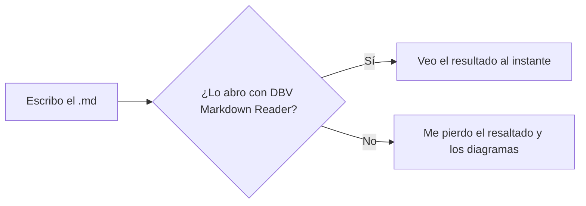
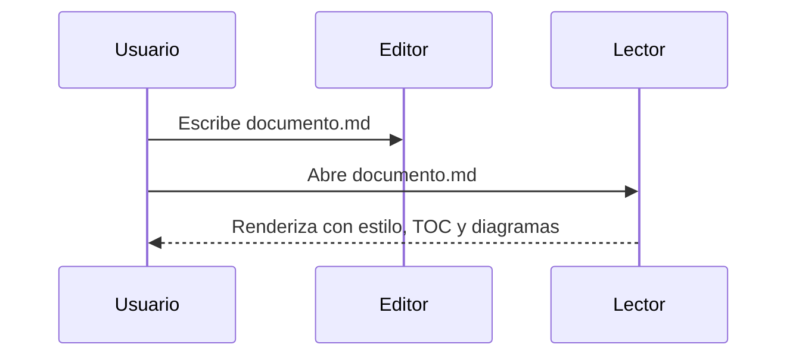

# 📘 Guía de referencia Markdown & GitHub Flavored Markdown

> Chuleta (*cheatsheet*) completa para escribir documentos `.md` desde cualquier editor de texto plano (Bloc de notas, Notepad++, VS Code, etc.) y visualizarlos perfectamente en **DBV Markdown Reader**.
>
> Copia, pega, modifica y guarda como `.md`. Todo lo que ves aquí abajo es también el resultado renderizado — abre este mismo fichero con DBV Markdown Reader para comprobarlo en vivo.

---

## 📑 Índice

- [1. Encabezados](#1-encabezados)
- [2. Énfasis (negrita, cursiva, tachado)](#2-énfasis-negrita-cursiva-tachado)
- [3. Párrafos y saltos de línea](#3-párrafos-y-saltos-de-línea)
- [4. Listas](#4-listas)
- [5. Listas de tareas (GFM)](#5-listas-de-tareas-gfm)
- [6. Enlaces](#6-enlaces)
- [7. Imágenes](#7-imágenes)
- [8. Citas (blockquotes)](#8-citas-blockquotes)
- [9. Código en línea y bloques de código](#9-código-en-línea-y-bloques-de-código)
- [10. Resaltado de sintaxis por lenguaje](#10-resaltado-de-sintaxis-por-lenguaje)
- [11. Tablas (GFM)](#11-tablas-gfm)
- [12. Líneas horizontales](#12-líneas-horizontales)
- [13. Autolinks y GFM autolinking](#13-autolinks-y-gfm-autolinking)
- [14. Notas al pie (footnotes)](#14-notas-al-pie-footnotes)
- [15. HTML embebido](#15-html-embebido)
- [16. Caracteres de escape](#16-caracteres-de-escape)
- [17. Emojis](#17-emojis)
- [18. Fórmulas matemáticas (KaTeX)](#18-fórmulas-matemáticas-katex)
- [19. Diagramas Mermaid](#19-diagramas-mermaid)
- [20. Alertas / callouts al estilo GitHub](#20-alertas--callouts-al-estilo-github)
- [21. Menciones y referencias a issues (solo texto)](#21-menciones-y-referencias-a-issues-solo-texto)
- [22. Buenas prácticas y trucos](#22-buenas-prácticas-y-trucos)

---

## 1. Encabezados

Seis niveles, del `#` (más importante) al `######` (menos importante). Deja siempre un espacio tras el/los `#`.

```markdown
# Título nivel 1
## Título nivel 2
### Título nivel 3
#### Título nivel 4
##### Título nivel 5
###### Título nivel 6
```

# Título nivel 1
## Título nivel 2
### Título nivel 3
#### Título nivel 4
##### Título nivel 5
###### Título nivel 6

> 💡 DBV Markdown Reader genera automáticamente la **Tabla de Contenidos (TOC)** navegable a partir de estos encabezados — no necesitas crearla a mano.

Alternativa "Setext" (solo para H1 y H2):

```markdown
Título como H1
==============

Título como H2
--------------
```

---

## 2. Énfasis (negrita, cursiva, tachado)

```markdown
*cursiva* o _cursiva_
**negrita** o __negrita__
***negrita y cursiva*** o **_combinado_**
~~tachado~~ (extensión GFM)
```

*cursiva* — **negrita** — ***negrita y cursiva*** — ~~tachado~~

---

## 3. Párrafos y saltos de línea

Un párrafo es una o más líneas de texto seguidas, separadas de otros párrafos por **una línea en blanco**.

Para forzar un salto de línea dentro del mismo párrafo (`<br>`), termina la línea con **dos o más espacios** o usa `\` al final:

```markdown
Primera línea con dos espacios al final··
Segunda línea, mismo párrafo.

Primera línea con barra invertida\
Segunda línea, mismo párrafo.
```

---

## 4. Listas

### Listas desordenadas

Se puede usar `-`, `*` o `+` indistintamente (no mezclar en el mismo nivel):

```markdown
- Primer elemento
- Segundo elemento
  - Sub-elemento (indenta con 2 espacios)
    - Sub-sub-elemento
- Tercer elemento
```

- Primer elemento
- Segundo elemento
  - Sub-elemento
    - Sub-sub-elemento
- Tercer elemento

### Listas ordenadas

```markdown
1. Primer paso
2. Segundo paso
   1. Sub-paso
   2. Otro sub-paso
3. Tercer paso
```

1. Primer paso
2. Segundo paso
   1. Sub-paso
   2. Otro sub-paso
3. Tercer paso

> 💡 El número inicial se respeta; el resto se renumera automáticamente aunque escribas `1.` en todas las líneas.

---

## 5. Listas de tareas (GFM)

Checkboxes interactivos (extensión GFM, soportada vía `markdown-it-task-lists`):

```markdown
- [x] Tarea completada
- [ ] Tarea pendiente
- [ ] Otra tarea pendiente
  - [x] Sub-tarea completada
```

- [x] Tarea completada
- [ ] Tarea pendiente
- [ ] Otra tarea pendiente
  - [x] Sub-tarea completada

---

## 6. Enlaces

```markdown
[Texto del enlace](https://ejemplo.com)
[Enlace con título](https://ejemplo.com "Este texto aparece al pasar el ratón")
[Enlace de referencia][ref]
[Enlace relativo a otro fichero](./otro-documento.md)
[Enlace a un encabezado de este documento](#6-enlaces)

[ref]: https://ejemplo.com "Definición de referencia"
```

[Texto del enlace](https://ejemplo.com) · [Enlace con título](https://ejemplo.com "Este texto aparece al pasar el ratón") · [Enlace de referencia][ref] · [Enlace relativo a otro fichero](./README.md) · [Enlace a un encabezado](#6-enlaces)

[ref]: https://ejemplo.com "Definición de referencia"

---

## 7. Imágenes

Igual que un enlace, con `!` delante:

```markdown


[](https://github.com/davidbuenov/dbv-md-reader)
```


[](https://github.com/davidbuenov/dbv-md-reader)

> 💡 Las rutas relativas se resuelven respecto a la ubicación del propio fichero `.md` abierto en el lector.

---

## 8. Citas (blockquotes)

```markdown
> Esto es una cita simple.

> Cita de varios párrafos.
>
> Segundo párrafo de la misma cita.

> Nivel 1
>> Nivel 2 (cita anidada)
>>> Nivel 3
```

> Esto es una cita simple.

> Cita de varios párrafos.
>
> Segundo párrafo de la misma cita.

> Nivel 1
>> Nivel 2 (cita anidada)
>>> Nivel 3

---

## 9. Código en línea y bloques de código

Código en línea con acentos graves simples: `` `código en línea` `` → `código en línea`

Bloques de código con **triple acento grave** y el nombre del lenguaje para resaltado de sintaxis:

````markdown
```python
def saludo(nombre: str) -> str:
    return f"Hola, {nombre}!"
```
````

```python
def saludo(nombre: str) -> str:
    return f"Hola, {nombre}!"
```

También puedes indentar con 4 espacios para un bloque de código "clásico" (sin resaltado de lenguaje):

```markdown
    este es un bloque de código
    indentado con 4 espacios
```

Renderizado:

    este es un bloque de código
    indentado con 4 espacios

---

## 10. Resaltado de sintaxis por lenguaje

DBV Markdown Reader colorea automáticamente los bloques de código según el identificador de lenguaje. Lenguajes soportados actualmente:

`bash` · `c` · `cpp` · `csharp` · `diff` · `docker` · `go` · `ini` · `java` · `json` · `jsx` · `markdown` · `powershell` · `python` · `rust` · `sql` · `toml`

```bash
#!/bin/bash
echo "Hola desde Bash"
```

```json
{
  "nombre": "dbv-md-reader",
  "version": "1.0.0"
}
```

```rust
fn main() {
    println!("Hola desde Rust");
}
```

> 💡 Además, cada bloque de código incluye **numeración de líneas** y un botón para copiar el contenido.

---

## 11. Tablas (GFM)

Las columnas no necesitan alinearse visualmente en el texto plano, aunque ayuda a la legibilidad. La alineación se controla con `:` en la fila separadora:

```markdown
| Columna izquierda | Columna centrada | Columna derecha |
| :----------------- | :---------------: | -----------------: |
| Texto              | Texto              | Texto              |
| Más texto largo    | Corto              | 123                |
```

| Columna izquierda | Columna centrada | Columna derecha |
| :----------------- | :---------------: | -----------------: |
| Texto              | Texto              | Texto              |
| Más texto largo    | Corto              | 123                |

---

## 12. Líneas horizontales

Tres o más guiones, asteriscos o guiones bajos en su propia línea:

```markdown
---
***
___
```

---

## 13. Autolinks y GFM autolinking

```markdown
<https://ejemplo.com>
<correo@ejemplo.com>

https://ejemplo.com (URL "pelada", GFM la detecta automáticamente sin necesidad de < >)
```

<https://ejemplo.com> — <correo@ejemplo.com>

---

## 14. Notas al pie (footnotes)

Extensión GFM soportada vía `markdown-it-footnote`:

```markdown
Aquí hay una afirmación que necesita respaldo[^1].

Y otra nota con nombre[^nota-larga].

[^1]: Esta es la nota al pie número uno.
[^nota-larga]: Las notas pueden tener **formato Markdown** completo,
    incluidas varias líneas si se indentan correctamente.
```

Aquí hay una afirmación que necesita respaldo[^1].

Y otra nota con nombre[^nota-larga].

[^1]: Esta es la nota al pie número uno.
[^nota-larga]: Las notas pueden tener **formato Markdown** completo, incluidas varias líneas si se indentan correctamente.

---

## 15. HTML embebido

Markdown permite HTML "en crudo" para casos que la sintaxis no cubre. DBV Markdown Reader lo sanea con **DOMPurify** antes de mostrarlo (por seguridad, se eliminan `<script>` y atributos peligrosos):

```markdown
<div align="center">
  <b>Texto centrado en negrita</b>
</div>

<details>
<summary>Haz clic para desplegar</summary>

Contenido oculto que se despliega al pulsar.

</details>
```

<details>
<summary>Haz clic para desplegar</summary>

Contenido oculto que se despliega al pulsar. Muy útil para FAQs o para ocultar bloques largos de log/código.

</details>

---

## 16. Caracteres de escape

Antepón `\` para mostrar literalmente un carácter con significado especial en Markdown:

```markdown
\* Esto no es una lista \*
\# Esto no es un encabezado
\[Esto no es un enlace\]
```

\* Esto no es una lista \* — \# Esto no es un encabezado — \[Esto no es un enlace\]

Caracteres escapables: `` \ ` * _ { } [ ] ( ) # + - . ! | ``

---

## 17. Emojis

Puedes pegar emojis Unicode directamente (✅ 🚀 📌 ⚠️), o usar el código `:nombre:` si tu editor de origen (p. ej. GitHub) lo soporta al exportar — DBV Markdown Reader muestra el emoji Unicode ya "cocido" en el propio texto.

```markdown
✅ Hecho — 🚧 En progreso — ❌ Bloqueado — ⚠️ Atención — 💡 Idea
```

---

## 18. Fórmulas matemáticas (KaTeX)

Notación matemática vía **KaTeX**: `$...$` para fórmulas en línea y `$$...$$` para fórmulas en bloque, centradas.

```markdown
La fórmula de la energía en reposo es $E = mc^2$, formulada por Einstein.

$$
\int_{a}^{b} f(x)\,dx = F(b) - F(a)
$$

$$
\frac{-b \pm \sqrt{b^2 - 4ac}}{2a}
$$
```

La fórmula de la energía en reposo es $E = mc^2$, formulada por Einstein.

$$
\int_{a}^{b} f(x)\,dx = F(b) - F(a)
$$

$$
\frac{-b \pm \sqrt{b^2 - 4ac}}{2a}
$$

---

## 19. Diagramas Mermaid

Bloques ` ```mermaid ` que se renderizan como diagramas vectoriales interactivos:

````markdown

````


También soporta diagramas de secuencia, de clases, de estados, Gantt, "pie", "gitGraph", etc. — cualquier sintaxis Mermoid estándar:



---

## 20. Alertas / callouts al estilo GitHub

GitHub Flavored Markdown define bloques de cita especiales para llamar la atención sobre un mensaje. Se escriben como una cita normal (`>`) con una etiqueta en la primera línea:

```markdown
> [!NOTE]
> Información útil que el lector debería tener en cuenta, aunque no sea esencial.

> [!TIP]
> Un consejo opcional para hacer algo mejor o más rápido.

> [!IMPORTANT]
> Información crucial que el usuario necesita para lograr su objetivo.

> [!WARNING]
> Contenido urgente que requiere atención inmediata para evitar problemas.

> [!CAUTION]
> Posibles consecuencias negativas o peligrosas de una acción.
```

> [!NOTE]
> Información útil que el lector debería tener en cuenta, aunque no sea esencial.

> [!TIP]
> Un consejo opcional para hacer algo mejor o más rápido.

> [!IMPORTANT]
> Información crucial que el usuario necesita para lograr su objetivo.

> [!WARNING]
> Contenido urgente que requiere atención inmediata para evitar problemas.

> [!CAUTION]
> Posibles consecuencias negativas o peligrosas de una acción.

---

## 21. Menciones y referencias a issues (solo texto)

Estas sintaxis son propias de la interfaz de GitHub (se convierten en enlaces cuando el documento vive **dentro** de un repositorio de GitHub). En un lector local como DBV Markdown Reader se muestran como **texto plano**, ya que no hay contexto de repositorio al que enlazar:

```markdown
@usuario           → mención de usuario (solo activa en GitHub)
#123               → referencia a issue/PR nº123 (solo activa en GitHub)
propietario/repo#123 → referencia cruzada a otro repositorio (solo activa en GitHub)
```

---

## 22. Buenas prácticas y trucos

- **Una idea por línea** en párrafos largos facilita el control de versiones (`git diff` línea a línea).
- Deja **una línea en blanco** antes y después de encabezados, listas, tablas y bloques de código — mejora la compatibilidad entre distintos motores de Markdown.
- Usa siempre el **mismo carácter** (`-`, `*` o `+`) para todos los ítems de una misma lista.
- Prefiere rutas **relativas** para imágenes y enlaces internos del proyecto, así el documento sigue funcionando si mueves la carpeta completa.
- Para tablas grandes, herramientas online tipo "Markdown Table Generator" ayudan a alinear columnas — aunque el espaciado visual en el `.md` es solo estético, no afecta al renderizado.
- Guarda siempre el fichero en codificación **UTF-8** (sin BOM) para evitar problemas con tildes, `ñ` y emojis.
- Si necesitas mostrar acentos graves literales dentro de un bloque de código (` ``` `), abre el bloque exterior con más acentos graves de los que uses dentro (por ejemplo, 4 backticks para envolver un bloque que ya contiene 3).

---

<div align="center">

📄 Documento de referencia generado para los usuarios de **[DBV Markdown Reader](https://github.com/davidbuenov/dbv-md-reader)** — ábrelo con la propia aplicación para ver el resultado renderizado en vivo.

</div>


VERIFICACION TRAS CODE_SIMPLIFY: