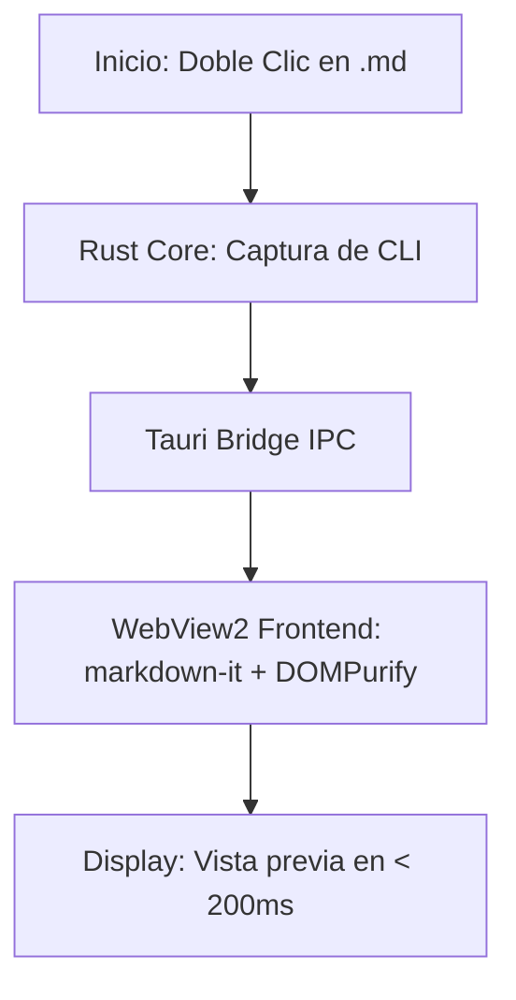

# 🚀 Bienvenido a dbv-md-reader

**dbv-md-reader** es un lector nativo de Markdown ultra-ligero y seguro para Windows.

---

## ✨ Características Principales 3 

1. **Rápido y Ligero:** Inicia en menos de 200 ms con menos de 64 MB de memoria RAM.
2. **Seguridad Estricta:** Sanitización de HTML embebido con DOMPurify para prevenir ataques XSS.
3. **Diagramas Mermaid:** Soporte completo de diagramas vectoriales.
4. **Navegación e Índice:** Tabla de Contenidos (TOC) auto-generada y búsqueda rápida con `Ctrl + F`.

---

## 📊 Ejemplo de Diagrama Mermaid



---

## 💻 Ejemplo de Código

```javascript
// app.js — Lógica de navegación e interceptor de enlaces
async function loadDocument(targetPathOrUrl) {
  const payload = await invoke('read_and_sanitize', { target: targetPathOrUrl });
  console.log('Documento cargado:', payload.file_name);
}
```

---

> 🛠️ Creado con **[dbv-specs-ops](https://github.com/davidbuenov/dbv-specs-ops)** por David Bueno Vallejo.
