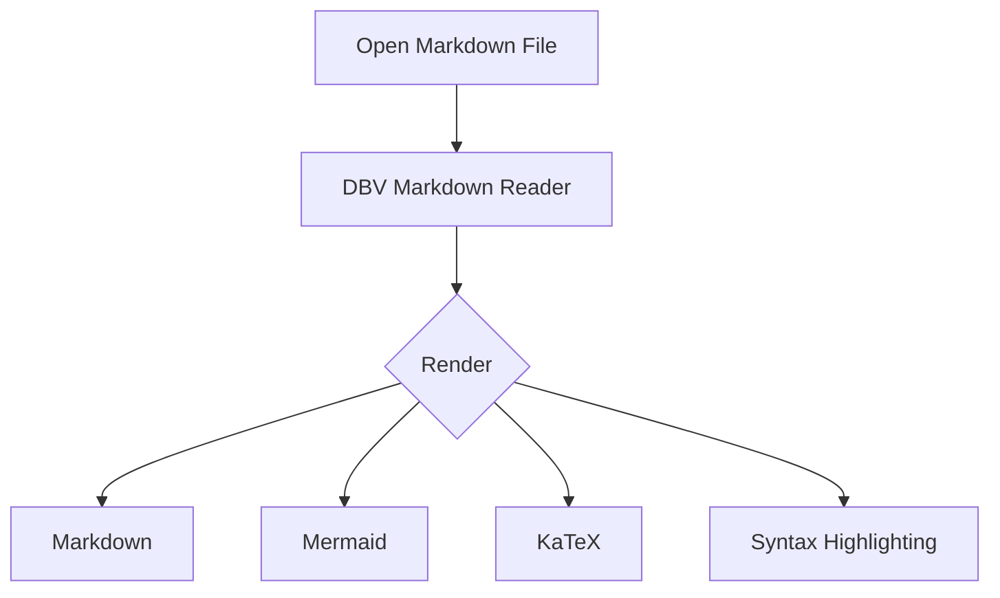
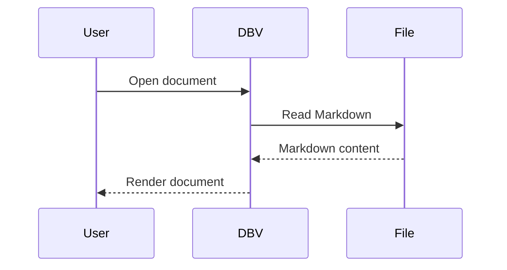
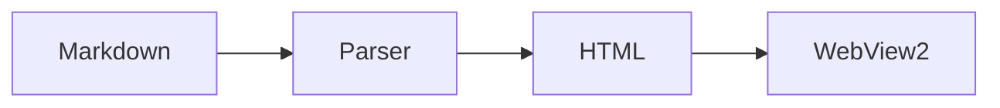

# GFM Compatibility Test

> **Purpose:** Comprehensive GitHub Flavored Markdown (GFM) compatibility test for DBV Markdown Reader.
>
> This file is intended as a visual and functional regression test. It covers the main GFM extensions and common Markdown edge cases.
>
> Expected result: the document should render correctly without modifying the source Markdown.

---

## 1. Headings

# Heading 1

## Heading 2

### Heading 3

#### Heading 4

##### Heading 5

###### Heading 6

---

## 2. Paragraphs and line breaks

This is a normal paragraph containing **bold text**, *italic text*, and `inline code`.

This paragraph contains  
a hard line break.

This is another paragraph.

---

## 3. Emphasis

**Bold**

__Bold using underscores__

*Italic*

_Italic using underscores_

***Bold and italic***

___Bold and italic using underscores___

~~Strikethrough~~

**Bold with *nested italic***

*Italic with **nested bold***

---

## 4. Inline code

Use `inline code` inside a sentence.

Use ``code containing `backticks` `` with double backticks.

Example command:

`git status`

---

## 5. Links

[GitHub](https://github.com/)

[Microsoft](https://www.microsoft.com/)

Autolink: https://github.com/

Email autolink: <test@example.com>

Reference-style link: [GitHub Reference][github]

[github]: https://github.com/

---

## 6. Images


Image with title:


---

## 7. Unordered lists

- Item 1
- Item 2
- Item 3
  - Nested item 3.1
  - Nested item 3.2
    - Nested item 3.2.1
- Item 4

Alternative syntax:

* Item A
* Item B
  * Nested B.1
  * Nested B.2

---

## 8. Ordered lists

1. First
2. Second
3. Third

Nested ordered list:

1. First
   1. First nested item
   2. Second nested item
2. Second

Mixed lists:

1. First
   - Nested unordered item
   - Another nested item
2. Second
   - Nested item

---

## 9. GFM Task Lists

- [ ] Unchecked task
- [x] Checked task
- [ ] Another unchecked task
  - [x] Nested checked task
  - [ ] Nested unchecked task

Task list containing formatting:

- [x] **Bold completed task**
- [ ] *Italic pending task*
- [x] `Code` completed task
- [ ] [Link](https://github.com/) pending task

---

## 10. Blockquotes

> This is a blockquote.

> This is a multiline blockquote.
>
> It contains multiple paragraphs.

Nested blockquote:

> Level 1
>
> > Level 2
> >
> > Nested content.
>
> Back to level 1.

Blockquote with formatting:

> **Important:** This text is bold.
>
> `Code inside a blockquote`

---

## 11. Fenced code blocks

```text
Plain text code block
Line two
Line three
```

### JavaScript

```javascript
function hello(name) {
    return `Hello, ${name}!`;
}

console.log(hello("GFM"));
```

### Python

```python
def hello(name):
    return f"Hello, {name}!"

print(hello("GFM"))
```

### JSON

```json
{
  "name": "DBV Markdown Reader",
  "format": "GFM",
  "test": true
}
```

### Bash

```bash
#!/bin/bash
echo "GFM test"
git status
```

### SQL

```sql
SELECT id, name
FROM users
WHERE active = 1
ORDER BY name;
```

### HTML

```html
<div class="example">
  <strong>GFM test</strong>
</div>
```

---

## 12. Indented code block

    This is an indented code block.
    It should be rendered as code.
    Indentation is significant.

---

## 13. Horizontal rules

---

***

___

---

## 14. Tables

Basic table:

| Name | Type | Status |
|---|---|---|
| DBV Markdown Reader | Application | Active |
| GitHub | Platform | Active |
| PowerToys | Toolkit | Active |

Aligned table:

| Left | Center | Right |
|:---|:---:|---:|
| A | B | C |
| 1 | 2 | 3 |
| Left aligned | Center aligned | Right aligned |

Table with formatting:

| Feature | Status | Notes |
|---|---|---|
| **TOC** | ✅ | Automatic |
| *Search* | ✅ | `Ctrl+F` |
| `Mermaid` | ✅ | Supported |
| [Links](https://github.com/) | ✅ | Clickable |

Table containing special characters:

| Expression | Result |
|---|---|
| `A \| B` | Escaped pipe |
| `A & B` | Ampersand |
| `<tag>` | HTML-like text |
| `a > b` | Comparison |

---

## 15. Escaped pipe in tables

| Column 1 | Column 2 |
|---|---|
| `A \| B` | Pipe inside code |
| A \| B | Escaped pipe |

---

## 16. Special characters

These characters should render as normal text when escaped:

\*asterisk\*

\_underscore\_

\# hash

\[brackets\]

\`backtick\`

\> greater-than

\+ plus

\- minus

\. period

\! exclamation mark

\\ backslash

---

## 17. HTML entities

&copy;

&reg;

&trade;

&nbsp;

&amp;

&lt;

&gt;

&quot;

&#169;

&#x1F4A1;

---

## 18. Unicode and emoji

Spanish: á é í ó ú ü ñ Ñ

French: à â ç é è ê ë

German: ä ö ü ß

Greek: α β γ δ Ω

Math symbols: ∑ ∫ √ ∞ ≠ ≤ ≥ ≈

Arrows: ← → ↑ ↓ ↔ ⇒ ⇔

Emoji: 😀 🚀 🧪 ✅ ❌ ⚠️ 🔥 📚 💻

---

## 19. Strikethrough

~~This text should be crossed out.~~

Normal text ~~struck~~ followed by normal text.

~~**Bold strikethrough**~~

~~*Italic strikethrough*~~

---

## 20. Automatic URL linking

https://github.com/davidbuenov/dbv-md-reader

https://github.com/microsoft/PowerToys

https://www.microsoft.com/

---

## 21. URL containing punctuation

Visit https://github.com/davidbuenov/dbv-md-reader.

Visit (https://github.com/davidbuenov/dbv-md-reader).

Visit [https://github.com/](https://github.com/).

---

## 22. Reference links

This is a [GitHub link][github-link].

This is another [PowerToys link][powertoys-link].

[github-link]: https://github.com/
[powertoys-link]: https://github.com/microsoft/PowerToys

---

## 23. Reference images

![GitHub logo][github-image]

[github-image]: https://github.githubassets.com/images/modules/logos_page/GitHub-Mark.png

---

## 24. Nested formatting

**Bold with `inline code`**

*Italic with [a link](https://github.com/)*

**Bold with [a link](https://github.com/)**

***Bold italic with `code`***

~~Strikethrough with **bold**~~

---

## 25. Nested lists with formatting

- **Bold item**
- *Italic item*
- `Code item`
- [Link item](https://github.com/)
- ~~Strikethrough item~~
- Item with nested content:
  - **Nested bold**
  - *Nested italic*
  - `Nested code`
  - [Nested link](https://github.com/)

---

## 26. Definition-like content

**GFM**

: GitHub Flavored Markdown

**DBV Markdown Reader**

: Lightweight Markdown reader for Windows.

> Note: Definition-list syntax is not part of standard GFM. A GFM-compatible renderer may therefore treat this as ordinary paragraphs rather than a semantic definition list.

---

## 27. Footnotes

GFM itself does not define footnotes as part of its core specification, but many Markdown parsers support them.

Here is a common footnote syntax:

This sentence has a footnote.[^1]

Another sentence with a second footnote.[^long]

[^1]: This is the first footnote.

[^long]: This is a longer footnote containing **bold text**, `code`, and a [link](https://github.com/).

> **Compatibility note:** DBV should document whether footnotes are intentionally supported or treated as non-GFM extensions.

---

## 28. Heading IDs / anchors

The following headings should generate navigable anchors where supported:

### A heading with spaces

### A heading with punctuation!

### A heading with `inline code`

### ¿Título en español?

### Heading with — em dash

---

## 29. Empty and whitespace-sensitive content

The next line is intentionally blank:

The previous line was followed by an empty line.

This line has trailing spaces that should not create unexpected visible artifacts.  

This is a normal paragraph after a line containing trailing spaces.

---

## 30. Consecutive paragraphs

Paragraph one.

Paragraph two.

Paragraph three.

---

## 31. Long paragraph

This is deliberately a long paragraph intended to test line wrapping, horizontal layout, reading width, typography, and scrolling behavior. DBV Markdown Reader should wrap this text naturally without introducing horizontal scrolling for ordinary prose. The rendered result should remain readable at different window sizes and zoom levels, including narrow windows, wide windows, and high-DPI displays.

---

## 32. Very long unbroken text

This_is_a_very_long_identifier_that_can_be_used_to_test_how_the_reader_handles_long_unbroken_strings_without_breaking_the_layout_or_creating_unexpected_horizontal_overflow_1234567890abcdefghijklmnopqrstuvwxyz.

---

## 33. Inline HTML

<strong>Bold HTML</strong>

<em>Italic HTML</em>

<mark>Highlighted HTML</mark>

<del>Deleted HTML</del>

<br>

<span>Inline span</span>

---

## 34. Block HTML

<div>

This is Markdown content inside a block HTML element.

</div>

---

## 35. HTML mixed with Markdown

<div>

**Markdown inside HTML**

[GitHub](https://github.com/)

</div>

> **Compatibility note:** Raw HTML handling depends on the parser and sanitization policy. DBV should preserve its security guarantees when rendering HTML.

---

## 36. Details / summary

<details>
<summary>Click to expand</summary>

This content is inside an HTML `<details>` element.

It contains **Markdown-like formatting** and `inline code`.

</details>

> **Compatibility note:** `<details>` is HTML rather than GFM-specific syntax.

---

## 37. Escaped HTML

\&lt;div\&gt;

\&lt;script\&gt;alert('test')\&lt;/script\&gt;

---

## 38. Code containing Markdown syntax

````markdown
# This should remain code

**Bold**

- Item
- [ ] Task

| A | B |
|---|---|
| 1 | 2 |

```javascript
console.log("nested-looking fence");
```
````


> **Important:** The inner fence above intentionally tests whether fenced code parsing handles nested fence-like content correctly.

---

## 39. Backticks

Single backticks:

`code`

Double backticks:

``code``

Code containing a backtick:

``code ` with backtick``

Code containing multiple backticks:

```code `` with multiple backticks```

---

## 40. Lists containing code blocks

- First item

  ```javascript
  const value = 42;
  console.log(value);
  ```

- Second item
  - Nested item

    ```text
    Nested code block
    ```

---

## 41. Lists containing blockquotes

- Item one

  > Quote inside a list item.

- Item two
  > Another quote.

---

## 42. Tables with multiline-looking content

| Feature | Example |
|---|---|
| Code | `const x = 1;` |
| Link | [GitHub](https://github.com/) |
| Bold | **important** |
| Strike | ~~removed~~ |
| Emoji | ✅ |
| Escaped pipe | `A \| B` |

---

## 43. GFM checkbox edge cases

- [x] lowercase x
- [X] uppercase X
- [ ] unchecked
- [  ] spaces inside brackets
- [] invalid/ordinary list syntax
- [y] invalid task marker
- [ x ] task marker with spaces

---

## 44. Ordered list edge cases

1. Item one
1. Item two
1. Item three

5. Item five
6. Item six
7. Item seven

---

## 45. Nested blockquote and list

> - Item inside quote
> - Another item
>
>   ```text
>   Code inside nested structure
>   ```
>
> > Nested quote
> >
> > - Nested list

---

## 46. Mermaid



---

## 47. Mermaid sequence diagram



---

## 48. Mathematical notation / KaTeX

Inline equation:

$E = mc^2$

Another inline equation:

$a^2 + b^2 = c^2$

Display equation:

$$
E = mc^2
$$

Quadratic formula:

$$
x = \frac{-b \pm \sqrt{b^2 - 4ac}}{2a}
$$

Integral:

$$
\int_0^\infty e^{-x^2}\,dx = \frac{\sqrt{\pi}}{2}
$$

Matrix:

$$
\begin{bmatrix}
1 & 2 \\
3 & 4
\end{bmatrix}
$$

> **Compatibility note:** KaTeX is an extension beyond core GFM. It is included here because DBV Markdown Reader supports it.

---

## 49. Syntax highlighting

```python
class MarkdownReader:
    def __init__(self, filename):
        self.filename = filename

    def open(self):
        print(f"Opening {self.filename}")

reader = MarkdownReader("GFM_test.md")
reader.open()
```

```rust
fn main() {
    println!("Hello from Rust");
}
```

```cpp
#include <iostream>

int main() {
    std::cout << "Hello from C++" << std::endl;
    return 0;
}
```

---

## 50. Task list with all major features

- [x] Markdown headings
- [x] Paragraphs
- [x] Emphasis
- [x] Strikethrough
- [x] Links
- [x] Images
- [x] Lists
- [x] Nested lists
- [x] Task lists
- [x] Blockquotes
- [x] Fenced code blocks
- [x] Syntax highlighting
- [x] Tables
- [x] Escaped pipes
- [x] Autolinks
- [x] HTML
- [x] Unicode
- [x] Emoji
- [x] Mermaid
- [x] KaTeX
- [ ] Footnotes — extension, not core GFM

---

## 51. Real-world README example

# Project Title

Short project description.

## Installation

```bash
git clone https://github.com/example/project.git
cd project
npm install
npm run build
```

## Features

- Fast startup
- Lightweight
- Cross-platform
- **Markdown rendering**
- Mermaid support
- Tables
- Search

## Configuration

| Option | Default | Description |
|---|---|---|
| `theme` | `dark` | Interface theme |
| `zoom` | `100%` | Initial zoom |
| `toc` | `true` | Show table of contents |

## Usage

1. Open a Markdown file.
2. Navigate using the TOC.
3. Press `Ctrl+F` to search.
4. Use zoom controls when needed.

## License

MIT

---

## 52. Complete mixed-content stress test

> **Stress test:** This section intentionally combines multiple Markdown constructs.

# DBV Markdown Reader

A **lightweight**, *read-only* Markdown reader with `GFM` support.

- [x] Fast
- [x] Lightweight
- [x] TOC
- [x] Search
- [x] Mermaid

### Architecture

| Component | Technology |
|---|---|
| Shell | Rust + Tauri |
| Renderer | WebView2 |
| Markdown | `markdown-it` |
| Diagrams | Mermaid |
| Math | KaTeX |

### Example

```rust
fn main() {
    println!("DBV Markdown Reader");
}
```

> **Important:** This is a blockquote containing `inline code`, **bold text**, and a [link](https://github.com/).



Mathematics:

$$
\sum_{i=1}^{n} i = \frac{n(n+1)}{2}
$$

---

# End of GFM Test

If every section renders correctly, DBV Markdown Reader has good coverage of the major GFM syntax and several common Markdown extensions.

## Suggested regression checks

- [ ] No unexpected horizontal overflow
- [ ] Headings generate correct hierarchy
- [ ] TOC contains the expected headings
- [ ] Current TOC section updates while scrolling
- [ ] Links are clickable
- [ ] Images load correctly
- [ ] Tables have correct alignment
- [ ] Task checkboxes render correctly
- [ ] Code blocks preserve whitespace
- [ ] Syntax highlighting is applied correctly
- [ ] Mermaid diagrams render
- [ ] KaTeX equations render
- [ ] HTML is sanitized safely
- [ ] Search finds text inside all major content types
- [ ] Zoom preserves layout
- [ ] Dark/light/sepia themes remain readable
- [ ] No Markdown syntax is accidentally displayed when it should be rendered
