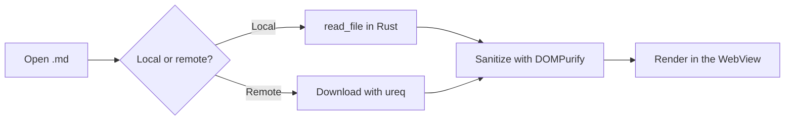

# Feature Demo — DBV Markdown Reader

This single document brings together the reader's main features: syntax highlighting across several languages, Mermaid diagrams, KaTeX math equations, and tables. Use it to quickly sanity-check a change or to grab screenshots.

Try switching between the **Light**, **Dark**, and **Sepia** themes (top right) while reading this document, and scroll down to see the Table of Contents highlight the active section and the reading-progress bar fill in.

## 1. Syntax highlighting

One language per block, to check that each one gets its own colors for keywords, strings, comments, numbers, and functions.

### C++

```cpp
void ACombatCharacter::ComboAttack()
{
    // Raise the attacking flag
    bIsAttacking = true;
    ComboCount = 0;

    PlayAttackSound();
    NotifyEnemiesOfIncomingAttack();
}
```

### Python

```python
def fibonacci(n: int) -> int:
    """Returns the n-th Fibonacci number."""
    a, b = 0, 1
    for _ in range(n):
        a, b = b, a + b
    return a


class Document:
    def __init__(self, path: str):
        self.path = path
        self.line_count = 0
```

### Rust

```rust
fn main() {
    let numbers = vec![1, 2, 3, 4, 5];
    let sum: i32 = numbers.iter().sum();
    println!("The sum is {sum}");
}
```

### TypeScript

```typescript
interface Document {
  path: string;
  content: string;
}

function readingTime(text: string, wordsPerMinute = 200): number {
  const words = text.trim().split(/\s+/).length;
  return Math.max(1, Math.round(words / wordsPerMinute));
}
```

### Bash

```bash
#!/bin/bash
echo "Building the project..."
for f in src/*.rs; do
  cargo check --manifest-path "$f" || exit 1
done
echo "Done."
```

### SQL

```sql
SELECT name, COUNT(*) AS opens
FROM recent_files
WHERE opened_at >= '2026-08-01'
GROUP BY name
ORDER BY opens DESC
LIMIT 10;
```

### JSON

```json
{
  "name": "dbv-md-reader",
  "version": "0.8.0",
  "private": true
}
```

### YAML

```yaml
name: dbv-md-reader
version: 0.8.0
platforms:
  - windows
  - linux
  - macos
```

## 2. Mermaid diagrams



## 3. Math equations (KaTeX)

Einstein's mass-energy equivalence formula is $E = mc^2$, one of the most famous equations in physics.

The general formula for solving a quadratic equation:

$$x = \frac{-b \pm \sqrt{b^2 - 4ac}}{2a}$$

The sum of the first $n$ natural numbers:

$$\sum_{i=1}^{n} i = \frac{n(n+1)}{2}$$

A simple definite integral:

$$\int_{0}^{1} x^2 \, dx = \frac{1}{3}$$

## 4. Table

| Language   | Family         | Vendored in v0.8.0 |
| ---------- | -------------- | -------------------- |
| C++        | Compiled       | ✅ |
| Python     | Interpreted    | ✅ |
| Rust       | Compiled       | ✅ |
| TypeScript | Transpiled     | ✅ |
| Bash       | Shell script   | ✅ |

## 5. Long line (to test the "Wrap line" button)

```javascript
const someVeryLongResultThatShouldTriggerHorizontalScrollByDefaultAndTheWrapToggleButtonWhenEnabled = computeSomethingVeryComplicated(paramOne, paramTwo, paramThree, paramFour, paramFive);
```

## 6. Wrap-up

If you scrolled all the way down here, you should have seen the Table of Contents highlight each section as you passed it, and the progress bar fill in the header. Next to this file's name you should also see the estimated reading time.
