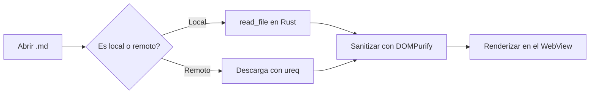

# Demo de funcionalidades — DBV Markdown Reader

Este documento reúne en un solo fichero las funcionalidades principales del lector: resaltado de sintaxis en varios lenguajes, diagramas Mermaid, ecuaciones matemáticas con KaTeX y tablas. Sirve para probar rápidamente un cambio o para generar capturas de pantalla.

Prueba a cambiar entre los temas **Claro**, **Oscuro** y **Sepia** (arriba a la derecha) mientras lees este documento, y haz scroll para ver cómo la Tabla de Contenidos resalta la sección activa y avanza la barra de progreso de lectura.

## 1. Resaltado de sintaxis

Un lenguaje distinto por bloque, para comprobar que cada uno tiene sus propios colores de palabra clave, cadena, comentario, número y función.

### C++

```cpp
void ACombatCharacter::ComboAttack()
{
    // Activa el estado de ataque
    bIsAttacking = true;
    ComboCount = 0;

    PlayAttackSound();
    NotifyEnemiesOfIncomingAttack();
}
```

### Python

```python
def fibonacci(n: int) -> int:
    """Devuelve el n-ésimo número de Fibonacci."""
    a, b = 0, 1
    for _ in range(n):
        a, b = b, a + b
    return a


class Documento:
    def __init__(self, ruta: str):
        self.ruta = ruta
        self.lineas = 0
```

### Rust

```rust
fn main() {
    let numeros = vec![1, 2, 3, 4, 5];
    let suma: i32 = numeros.iter().sum();
    println!("La suma es {suma}");
}
```

### TypeScript

```typescript
interface Documento {
  ruta: string;
  contenido: string;
}

function tiempoDeLectura(texto: string, palabrasPorMinuto = 200): number {
  const palabras = texto.trim().split(/\s+/).length;
  return Math.max(1, Math.round(palabras / palabrasPorMinuto));
}
```

### Bash

```bash
#!/bin/bash
echo "Compilando el proyecto..."
for f in src/*.rs; do
  cargo check --manifest-path "$f" || exit 1
done
echo "Listo."
```

### SQL

```sql
SELECT nombre, COUNT(*) AS aperturas
FROM archivos_recientes
WHERE fecha >= '2026-08-01'
GROUP BY nombre
ORDER BY aperturas DESC
LIMIT 10;
```

### JSON

```json
{
  "name": "dbv-md-reader",
  "version": "0.8.0",
  "private": true
}
```

### YAML

```yaml
nombre: dbv-md-reader
version: 0.8.0
plataformas:
  - windows
  - linux
  - macos
```

## 2. Diagramas Mermaid



## 3. Ecuaciones matemáticas (KaTeX)

La fórmula de la energía relativista de Einstein es $E = mc^2$, una de las ecuaciones más conocidas de la física.

La fórmula general para resolver una ecuación de segundo grado:

$$x = \frac{-b \pm \sqrt{b^2 - 4ac}}{2a}$$

La suma de los primeros $n$ números naturales:

$$\sum_{i=1}^{n} i = \frac{n(n+1)}{2}$$

Una integral definida sencilla:

$$\int_{0}^{1} x^2 \, dx = \frac{1}{3}$$

## 4. Tabla

| Lenguaje   | Familia        | Vendorizado en v0.8.0 |
| ---------- | -------------- | ---------------------- |
| C++        | Compilado      | ✅ |
| Python     | Interpretado   | ✅ |
| Rust       | Compilado      | ✅ |
| TypeScript | Transpilado    | ✅ |
| Bash       | Script de shell| ✅ |

## 5. Línea larga (para probar el botón "Wrap line")

```javascript
const resultadoMuyLargoQueDeberiaProbarElScrollHorizontalPorDefectoYElBotonDeAjusteDeLineaCuandoSeActiva = calcularAlgoMuyComplicado(parametroUno, parametroDos, parametroTres, parametroCuatro, parametroCinco);
```

## 6. Cierre

Si has llegado hasta aquí haciendo scroll, habrás visto la Tabla de Contenidos resaltar cada sección por la que has ido pasando, y la barra de progreso avanzar en la cabecera. Junto al nombre de este archivo también deberías ver el tiempo de lectura estimado.
